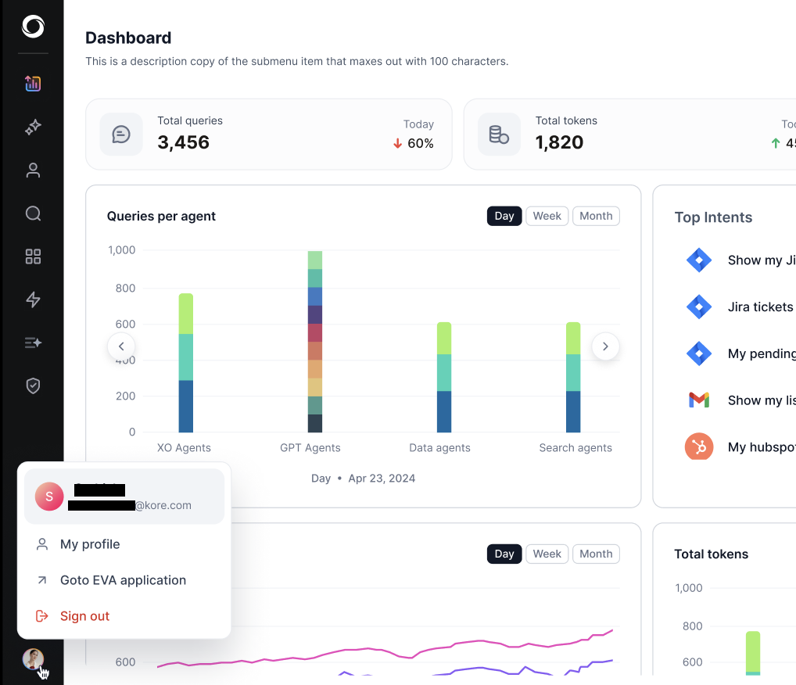
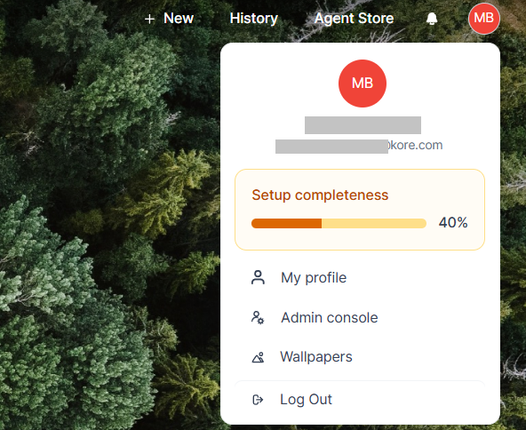
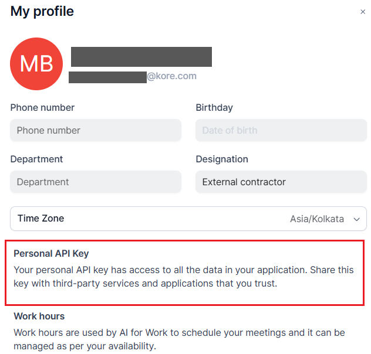

# Authorization

An API key identifies and authorizes users, granting access rights to the API.
It simplifies the authentication process by allowing users to provide a single
key instead of a username and password combination. To access the API, the user
must include their personal API key in the request headers.

## Accessing the Personal API Key

Steps to generate and manage your key:

1.  Click on the profile icon located in the lower-left corner of the admin
    dashboard and select **My profile**.  
    

    Alternatively, you can also retrieve the key from the **My Profile** section
    of the application, located in the upper-right corner of the
    homepage.

2.  Navigate to the Personal API Key section and click on
    it.

3.  Once generated, you can:

    -   Copy the key for immediate use.

    -   Regenerate the key.

    -   Delete the key if it is no longer
        needed.

### Using the Personal API Key

Include the Personal API Key in the Authorization header of your API requests as
follows:

```
--header 'auth: {{Admin’s Personalkey}}'

```
