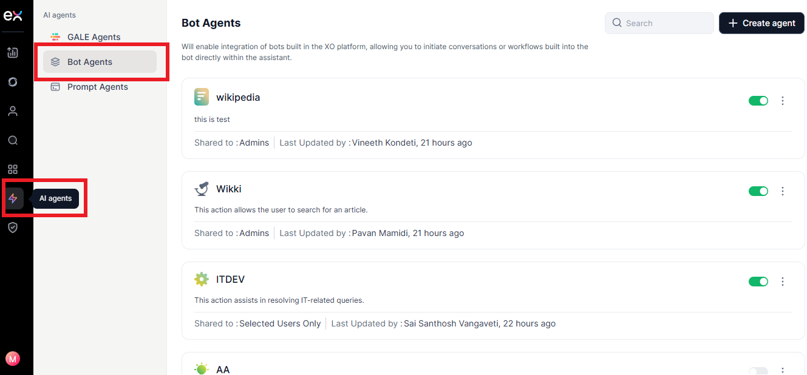
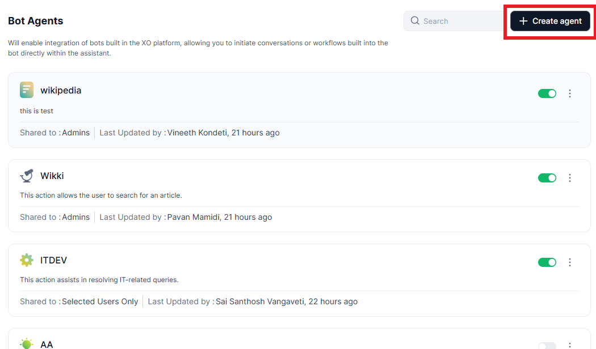
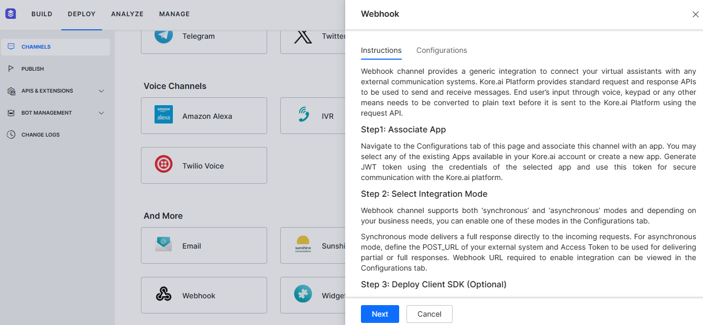
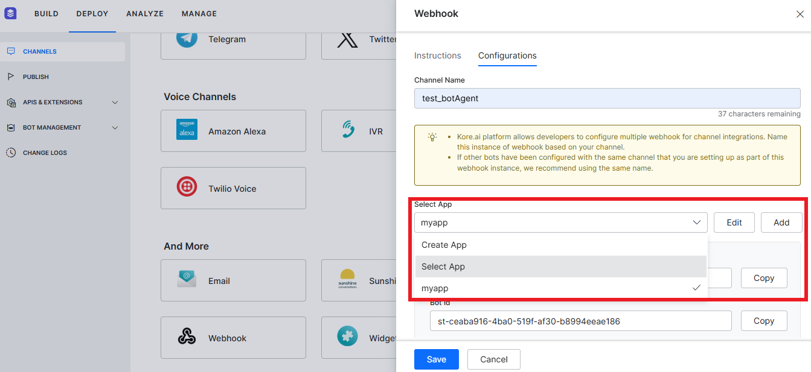
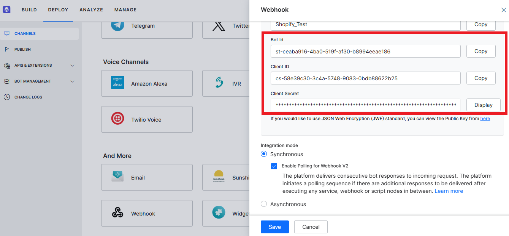
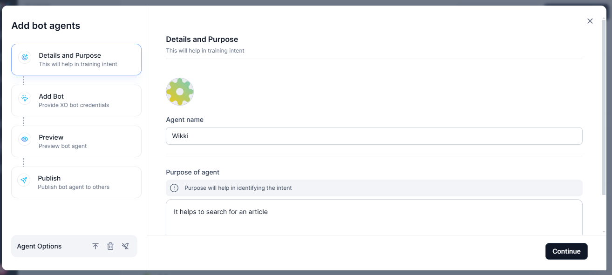
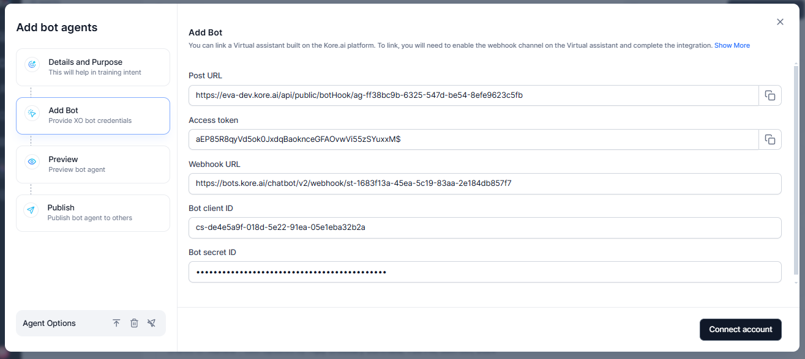
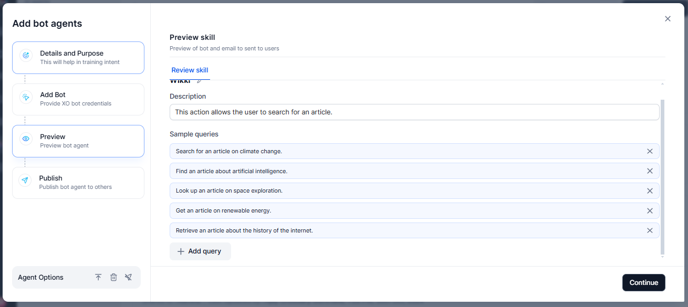
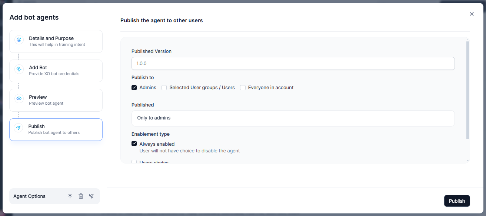
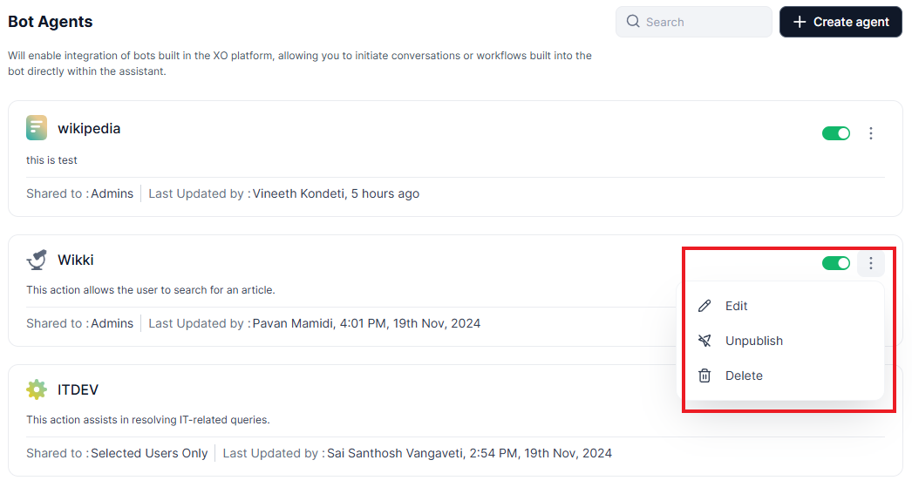

# Bot Agents

Administrators can create bot agents for users using the bot agent builder, significantly improving overall efficiency. Workflows designed on the XO Platform can be seamlessly integrated, allowing actions to be executed directly when a workflow is triggered and eliminating the need for other platforms.

For complex workflows involving multiple system integrations and logic, users can build bots using the XO Platform. These bots can be triggered through conversations using the UI or NLP intent, streamlining the entire process.

For example, consider a Fund Transfer Bot Agent. By creating this bot on the XO Platform, you can automate fund transfers to clients' designated accounts, capturing key details such as client names, account information, and transfer amounts. Once integrated with your organization’s systems, the bot allows seamless conversational interactions, simplifying fund transfer operations.

To use this bot:

-   Click the “Internal transfer bot” agent to view sample queries.

-   Select “Transfer funds” from the list. The system will prompt you to enter the client’s name, followed by the recipient’s name.

-   Input the transfer amount and confirm the transaction. Funds are transferred effortlessly from a single platform, and a summary of the conversation is automatically generated.

##  Create a new Bot Agent

You can create a new Bot agent to assist users in completing various tasks by
utilizing the Bot created using the XO Platform.

To create a new Bot Agent, follow these steps:

1.  In the **Admin Console**, click **AI Agents** from the left pane, and then
    select **Bot Agents**. A list of available bot agents will be displayed.

    

2.  On the Workflow Agents page, click **+Create
    Agent.**

3.  You must link your Bot built on the XO Platform with **AI for Work** and
    create a webhook channel. To create a webhook channel on the Bot and
    complete the integration process, follow these steps:

    1.  Log in to the **XO Platform**. Open the virtual assistant or bot you
        want to add the channels to. Go to **Deploy \> Channels**\> **Add
        More\>Webhook**. The Webhook dialog will
        appear.

    2.  Select your required app from the **Webhook** dialog.
        

    3.  Copy the **Bot client ID** and **Bot secret ID** to use in the **AI for
        Work** platform to complete the
        integration.

    4.  Under the **Configured Channels** section, click the **\<\<Name of the
        Bot\>\>** you have created and want to integrate with **AI for Work**.
        The channel you have created is now enabled. For more information, see
        [Channel
        Enablement](https://developer.kore.ai/docs/bots/channel-enablement/adding-channels-to-your-bot/).

        **Note**: You can create a new client app for your app by providing the
        JWT tokens generated using the **Post URL** and **Access tokens**
        available in the **Add bot agents** dialog in the **Add Bot** section.

###  Step 1: Details and Purpose

Provide a suitable and unique name for the agent and describe the purpose of the
agent. Defining the agent’s purpose enables it to accurately recognize the
agent’s capabilities and effectively utilize them to respond to user queries
aligned with the specified intent. It is essential to clearly outline the
specific use cases for which the agent is designed.

###  Step 2: Add Bot

The Add Bot feature enables seamless integration of a virtual assistant created
on the Kore.ai platform with your system. To establish this connection, ensure
that the webhook channel is enabled on the Kore.ai Virtual Assistant. Once
activated, follow the integration steps to complete the process:

1.  In the **Add Bot** enter the following:

    1.  Enter the **Bot client ID** you fetched from the Bot Webhook dialog.

    2.  Enter the **Bot secret ID** you fetched from the Bot Webhook dialog.

    3.  Enter the **Webhook URL** that you have fetched from the Bot Webhook
        dialog.

2.  Click **Connect account** to move to the next step.

## Step 3: Preview

In the **Preview** section, a sample of queries is displayed. If necessary, you
can click the **+ Add Query** button to add any other queries. Click
**Continue** to move to the next step.

###  Step 3: Publish Bot Agent

In the **Publish** section, you can publish the agent so the users can use it as
required.

-   Enter the **Published version** number.

-   Select the option to **Publish to** either Admins, Selected users, or
    Everyone in the account.

-   Select the **Enablement type** option. If you select **Always enabled**, the
    user will not have the choice to disable the agent. If you select the
    **Users choice**, the user can enable/ disable the agent based on the
    requirement.

    

-   The **Publish log** will display the published versions of the agent. Click
    **Publish** to publish this agent. Once published, your agent is displayed
    in the Agent list of the **Admin console** page.

The user can see this agent in the **Agents list** on the **Agents** page.

**Note**: On the Agents list page, you can click the three dots icon
corresponding to the agent's name and publish the agent later if necessary.

##  Modify a Bot Agent Details

You can change the form if required.

To modify the agent, follow these steps:

1.  Click the three dots icon corresponding to the agents' names on the Agents
    list page. A pop-up with a list of options will then appear.

    

2.  Click the **Edit** option from the options to modify the form.
