# GALE Agent

The Workflow or GALE Agent allows users to build agents directly with the **GALE platform** to deliver precise, contextually relevant responses to user queries in real time. This streamlined approach simplifies the process of
creating intelligent agents, enabling businesses to deploy solutions quickly and efficiently.

The Agent leverages APIs and combines retrieval and generation techniques to provide accurate and contextually relevant answers to user queries. These highly configurable agents allow users to select and fine-tune models from various options within the GALE platform. Once configured, these agents dynamically adapt to user inputs, providing real-time, intelligent responses.

##  Create GALE Agent

To create a GALE Agent, follow the steps outlined below:

1.  In the **Admin Console**, click **AI Agents** from the left pane, and then select **GALE Agents**. A list of available workflow agents will be
    displayed.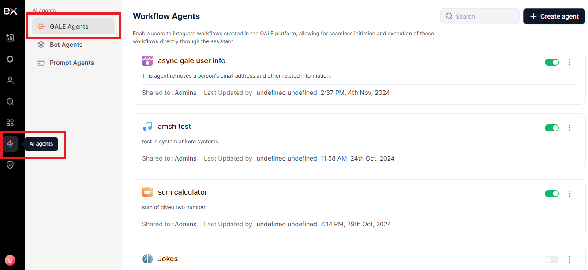

2.  On the Workflow Agents page, click **+Create
    Agent**.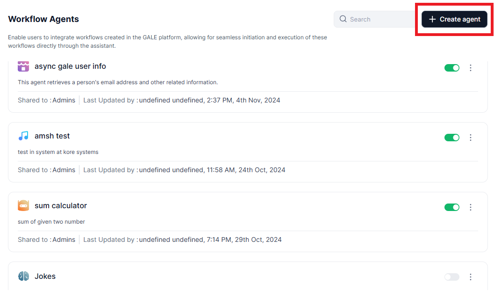

3.  The **Workflow** / **GALE Agent creation** wizard will take you
    through the following steps:

    1.   **Step 1: Define the purpose of the Agent**

    2.   **Step 2: Configure GALE Flow** 

    3.   **Step 3: Review the Agent configuration**

    4.   **Step 3: Publish the Agent**

###  Step 1: Details and Purpose

Provide a suitable and unique name for the agent and describe the purpose of the
agent. Defining the agent’s purpose enables “AI for work” to accurately
recognize the agent’s capabilities and effectively utilize them to respond to
user queries aligned with the specified intent. It is essential to clearly
outline the specific use cases for which the agent is designed.

For instance, if an agent called "Sales Buddy" is created to handle user
queries, specifying its purpose helps this agent whenever a user sends a query
related to any cross-sell or upsell product.

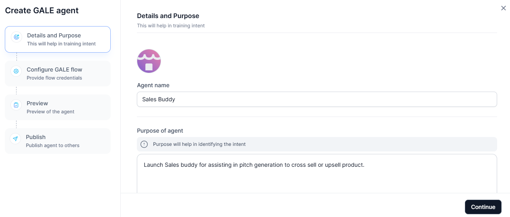

###  Step 2: Configure GALE Flow

You must integrate **GALE Flow** with the **GALE** platform and create a
channel. To set up a channel and complete the integration process, follow the
steps outlined below:

1.  In the **Define GALE API** section, select between **Sync Mode** and **Async
    Mode**, depending on the requirements of your interactions.

    1.  **Sync Mode**: In sync mode, users receive immediate responses. This
        mode doesn’t require a POST URL or access token, making it simple for
        quick interactions. However, sync mode includes a 60-second timeout, so
        it’s best suited for gale workflow that can be completed within that
        timeframe.

    2.  **Async Mode:** In async mode, the setup is more flexible and is ideal
        for cases that may take longer than 60 seconds. This mode requires a
        POST URL and the agent’s access token to be specified in the GALE agent
        endpoint. Once the agent completes its process, GALE posts the response
        back to the specified endpoint.

2.  For Async Mode, enter the **POST URL** and **Access
    token**.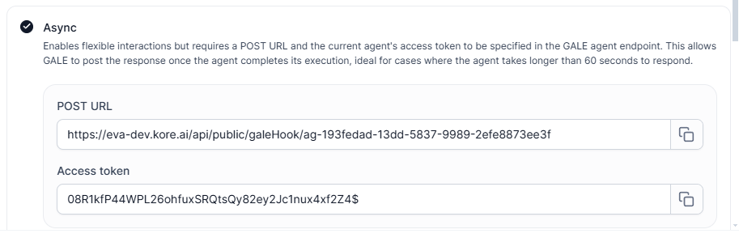  
    To configure async mode with the GALE Platform, copy the **POST URL** and
    **Access Token** from the agent, then follow the steps outlined below.

    1.  Navigate to the GALE Platform. Open the agent you want to add the
        channels to.

    2.  On the **Agents** tab, click the name of the agent that you want to
        integrate and then click **Agent endpoint** in the left
        navigation.

    3.  Select the **Async push** to enable asynchronous response handling and
        click the settings icon next to the **Async push**
        option.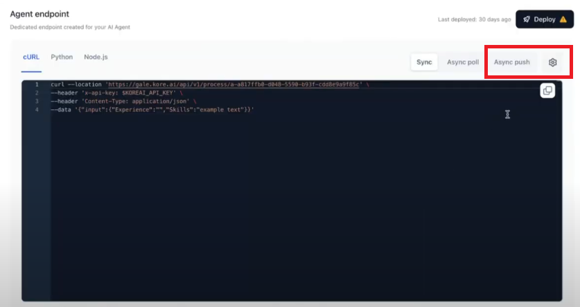

    4.  Next, paste the copied **POST URL** and **Access Token** into the
        appropriate fields on the **Sync/Async mode setup** page.  
        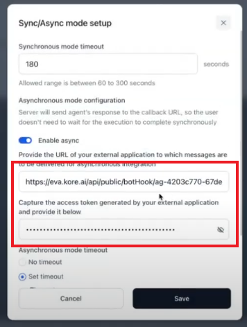

    5.  Click **Save** to save the configuration.

3.  Next, on the **Define API** page, click on the **CURL Import**
    option.

4.  The **Import URL** dialog is displayed.
    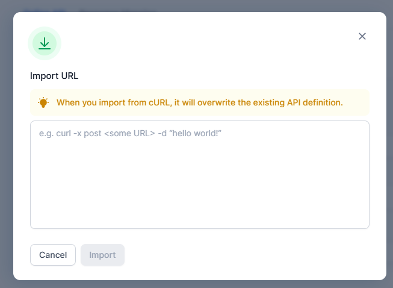To get the curl, follow the
    steps outlined below

    1.  Navigate to the GALE Platform. Open the agent you want to add the
        channels to.

    2.  On the **Agents** tab, click the name of the agent that you want to
        integrate and then click **Agent endpoint** in the left
        navigation.

    3.  Copy the appropriate cURL to use in the platform to complete the
        integration. Use the sync cURL for sync mode and the async cURL for asyn
        mode.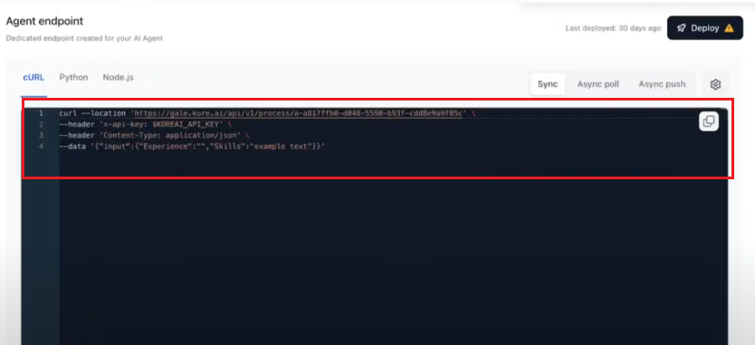

5.  In the **Import URL,**  paste the **cURL**  that you have fetched from the
    GALE Agent.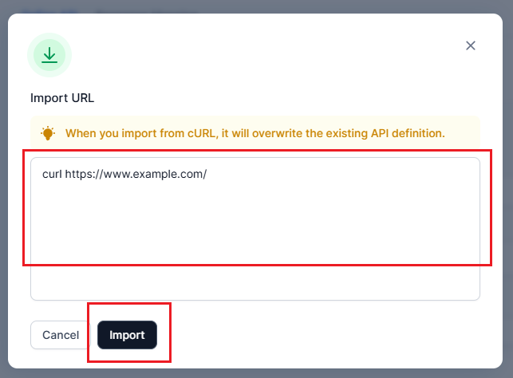

6.  Click **Import** to add the cURL

7.  Click **Run** to fetch the API details.  
    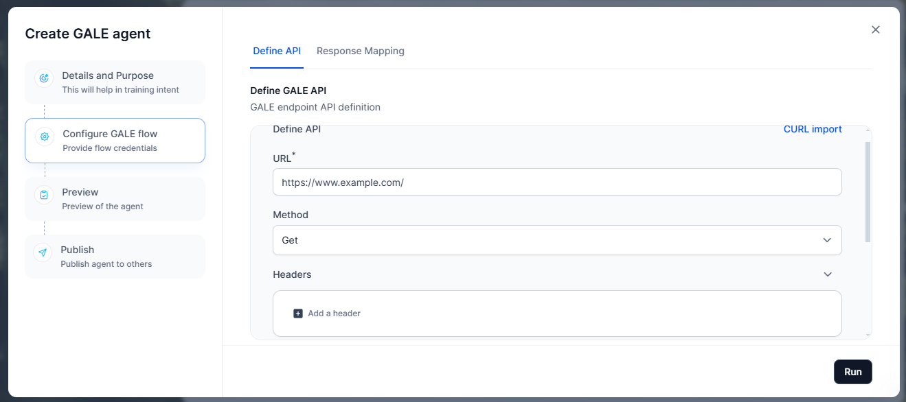

8.  Once the API details are fetched, click
    **Continue**.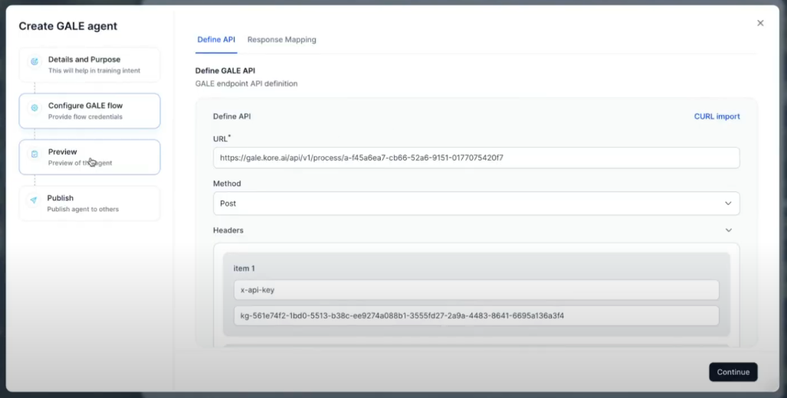

9.  The API response output displays all the keys received in the response.
    These keys are used to map the specific value that should be shown to the
    end user.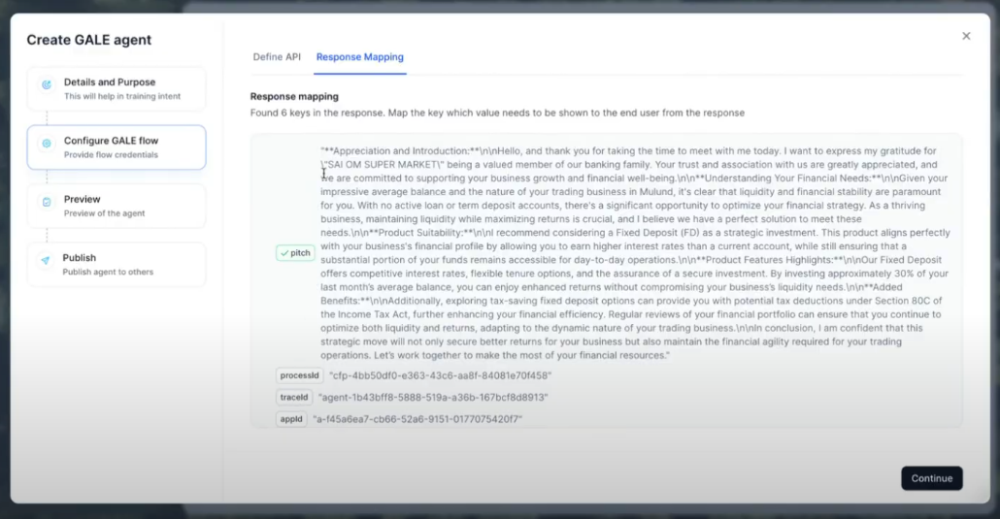

10.  Click **Continue** to move to the next step.

###  Step 3: Preview

In the **Preview** section, a list of sample queries is displayed. If needed,
you can add additional queries by clicking the **+ Add Query** button. Once
you're ready, click **Continue** to proceed to the next
step.

###  Step 4: Publish Workflow Agent / GALE Agent

In the **Publish** section, you can finalize and deploy your GALE
agent. Follow the steps outlined
below to publish the GALE agent

1.  Provide the following details

    -   **Published Version**: Select the version of the agent you are
        publishing.

    -   **Publish to**: Choose who will have access to the agent:

        -   **Admins**: Restrict the agent to Admin users only.

        -   **Selected User Groups/Users**: Specify individual users or groups.

        -   **Everyone in the Account**: Make the agent available to all users.

    -   **Enablement Type**: Define how users can enable or disable the agent:

        -   **Always Enabled**: Users cannot disable the agent; it is always
            active.

        -   **User's Choice**: Users can choose whether to enable or disable the
            agent as needed.

2.  Click **Publish.** Once published, your agent is displayed in the Agent list
    of the Admin console page.

##  Modify a Workflow Agent / GALE Agent

To modify the workflow agent / GALE agent, follow these steps:

1.  Navigate to the **Agents list** page and locate the agent you wish to
    modify.  
    
    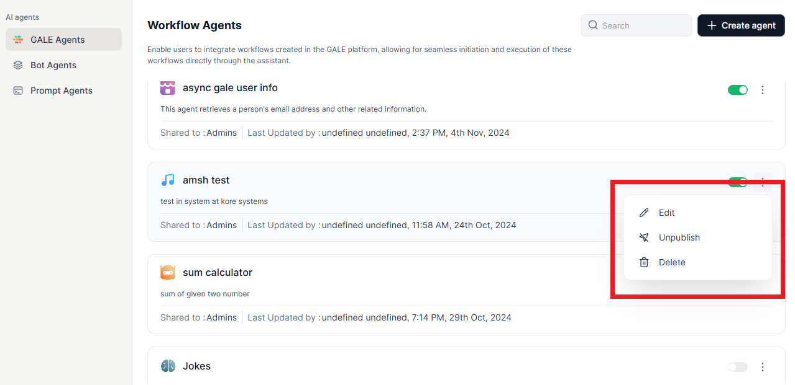

2.  Click the **three dots icon** next to the agent’s name. A menu with the
    following options will appear:

-   **Edit** – Open and modify the agent's details.

-   **Publish/Unpublish** – Change the agent's status.

-   **Delete** – Permanently remove the agent.

1.  Click on the required option and continue to complete the modifications as
    needed.

##  Manage Input and Output

In GALE, Agent Flows provide a structured way to manage input and output
variables that control data flow and context throughout the agent's execution.

-   **Input Variables:** The input variables provide initial data to the agent
    flow.

-   **Output Variables:** The output variables store and make accessible the
    derived values from the flow. You must define output variables to capture
    the results you want to return from the agent.

Once input and output variables are defined in the GALE Flow, they become
accessible throughout the flow and will be automatically displayed in “AI for
Work”. This makes it easy to view and manage the data exchange between the agent
and the connected platform.

For more information on input and output variables, refer to the [manage input
and
output.](https://docs.kore.ai/gale/agents/agents-flows/perform-other-actions-on-the-flow-builder/manage-input-and-output/)

##  User Interaction with Sync and Async Flows

The end-user experience varies between sync and async flows in the GALE Agent,
offering flexibility in response times and delivery methods.

In **sync mode**, users can expect immediate responses. After selecting the
appropriate agent, users simply enter a query and receive a real-time answer
displayed within the current interface. This real-time interaction is ideal for
scenarios requiring quick responses, as the system processes the request and
displays the output directly within the current session. This mode is ideal for
cases where the file processing can be completed within a short timeframe (up to
60 seconds), allowing users to quickly retrieve answers.

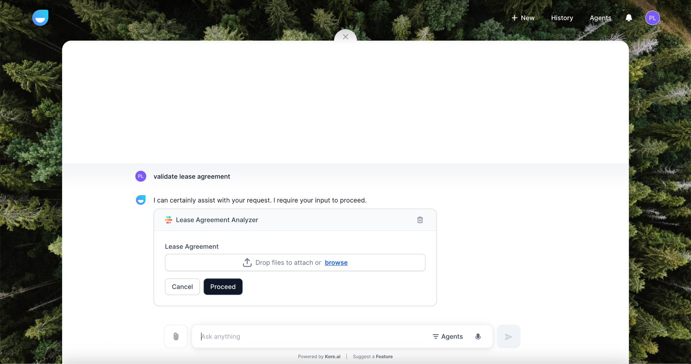

In **async mode**, the process accommodates more complex queries that may
require additional processing time. Users still select an agent and enter their
queries as usual. However, instead of receiving immediate results, they are
notified in a notification section once the query is processed. This approach
makes async mode particularly suited to cases where the query might take more
than 60 seconds to execute.

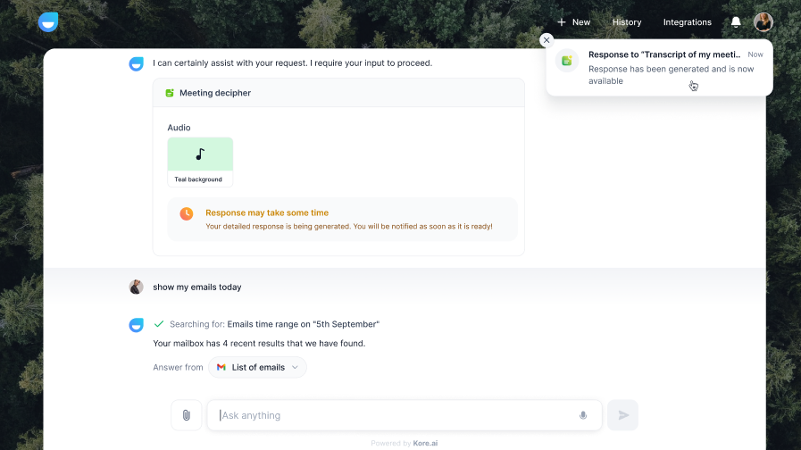
