# GPT Agents

GPT agents collect specific user inputs as variables to customize prompts, enabling various use cases such as content generation, language translation, and text summarization. Administrators can create GPT agents for users using the GPT agent builder. 

GPT agents operate using two distinct components:

-   **User-Collected Inputs**: In this scenario, the user's inputs are
    incorporated into the prompt as variables to generate the required response.
    For instance, a job description (JD) can be created using user inputs
    regarding experience, responsibilities, and required skills.

-   **Administrator-Uploaded Knowledge**: In this scenario, an administrator can
    upload a file to be used as a template. For example, a JD can be generated
    based on user-provided inputs and a pre-uploaded template that the agent
    will utilize to ensure consistency and adherence to specific formatting
    guidelines.

## Create a new GPT Agent

 

You can create a new GPT agent to assist users in completing various tasks by
utilizing the GPT capabilities.

To create a new GPT Agent, follow these steps:

1.  In the **Admin Console**, click **AI Agents** from the left pane, and then
    select **Prompt Agents**. A list of available prompt agents will be
    displayed.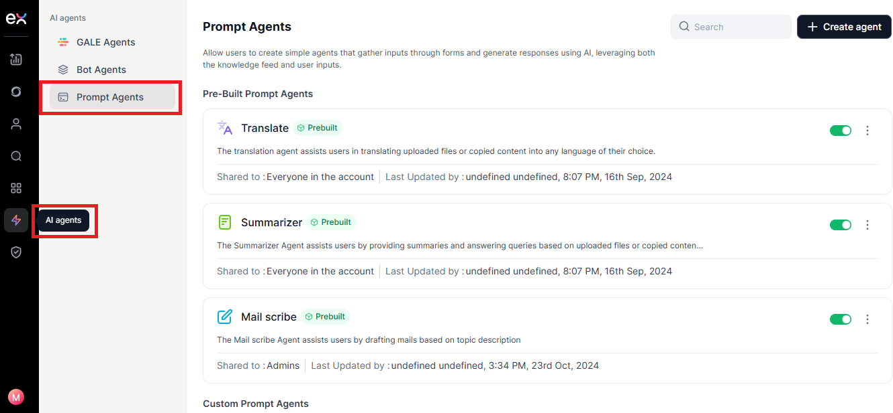

2.  On the Prompt Agents page, click **+Create**
    Agent.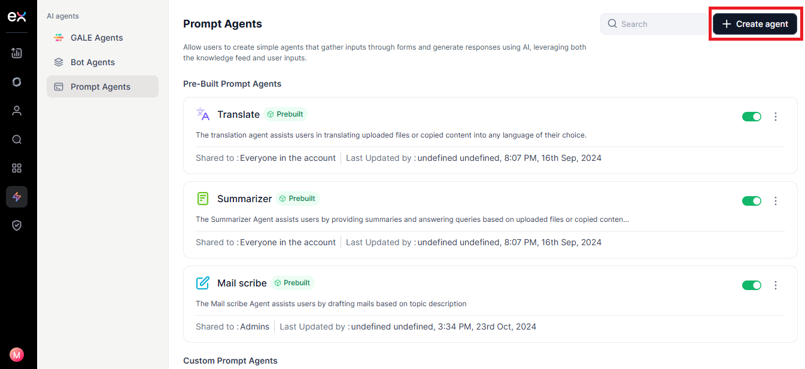

3.  The **Prompt Agent creation** wizard will take you through the following
    steps:

    1.   **Step 1: Define and Purpose**

    2.   **Step 2: Source Configuration** 

    3.   **Step 3: Review the Agent configuration**

    4.   **Step 3: Publish the Agent**

### Step 1: Details and Purpose

Provide a suitable and unique name for the agent and describe the purpose of the
agent. Defining the agent’s purpose enables EVA to accurately recognize the
agent’s capabilities and effectively utilize them to respond to user queries
aligned with the specified intent. It is essential to clearly outline the
specific use cases for which the agent is designed. It is important to add a
purpose, as all the fields, queries, and prompts are auto-generated based on the
purpose provided.

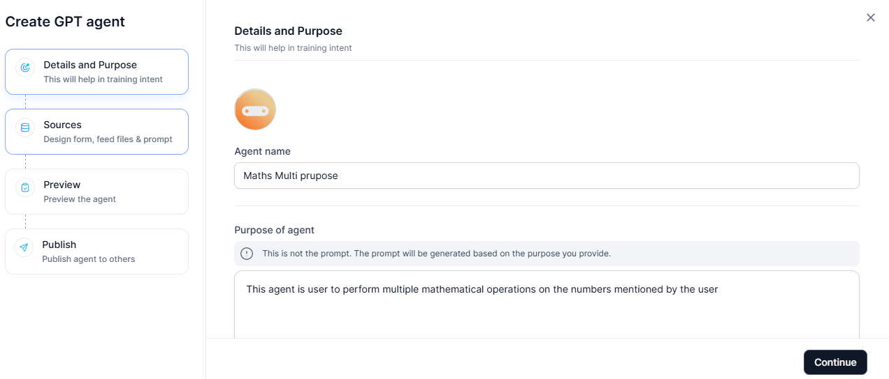

### Step 2: Source

In the Sources section, you can configure user input, Knowledge and prompts. The
parameters fields are provided based on the Purpose of the agent you provided in
the previous step. For example, if the purpose is "summarization", fields might
include Word Count, Summary Format
etc.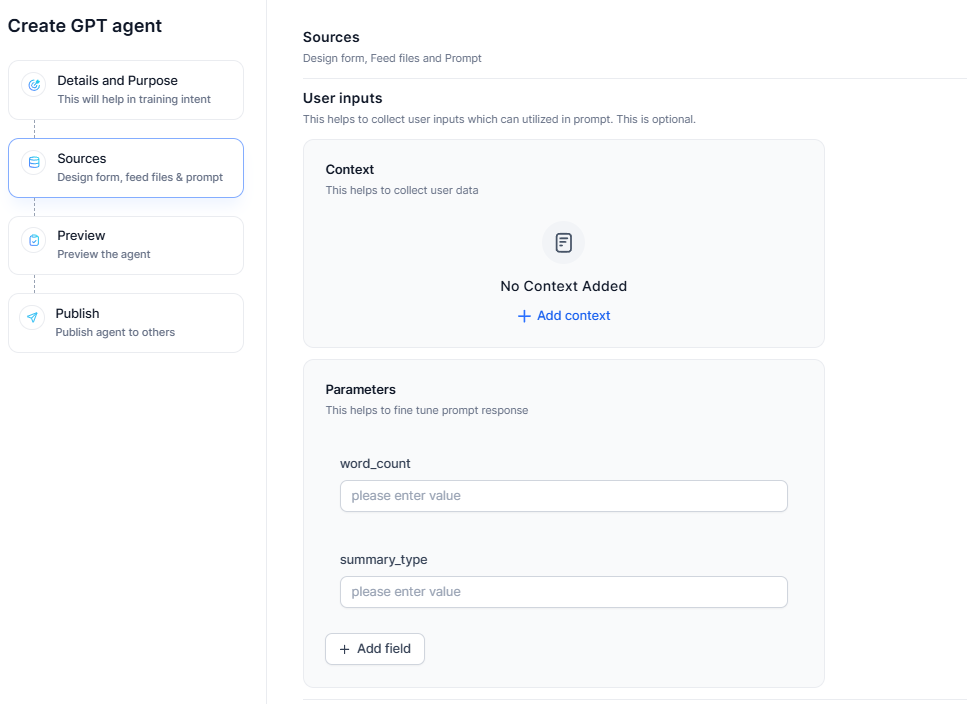

#### User Input

To configure user input, follow the steps outlined below:

1.  Click on the **+Add context**.
    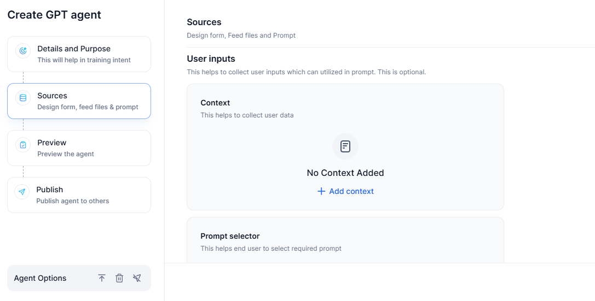

2.  Enter context name and any placeholder text in the **placeholder text**
    field if required.  
    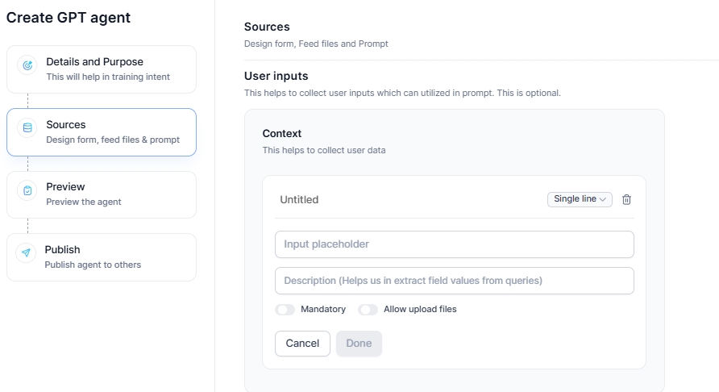

3.  Select the **Field type** from the list for each field. You can select a
    single-line, multiline, single-select, multi-select, number, file upload, or
    URL based on the fields.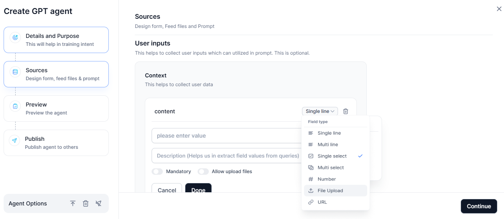

4.  Click the mandatory toggle button ON if you want the field to be mandatory
    and click **Done**.

5.  In the parameter section, enter parameter details. Parameters are
    prepopulated based on the agent’s purpose. Click on **+ Add field** if
    required.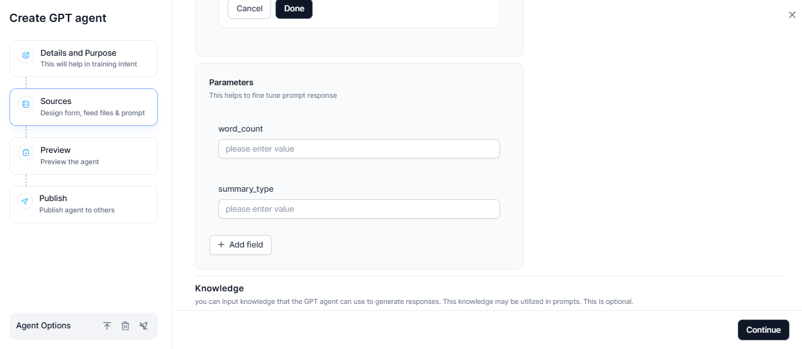

6.  Enter a name and any placeholder text in the **placeholder text** field.  
    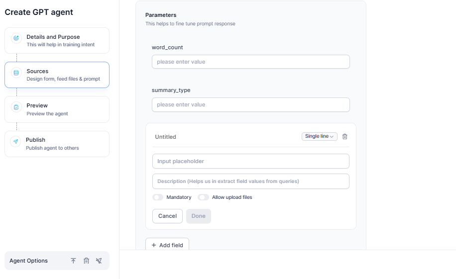

7.  Select the **Field type** from the list for each field. You can select a
    single-line, multiline, single-select, multi-select, number, file upload, or
    URL based on the fields.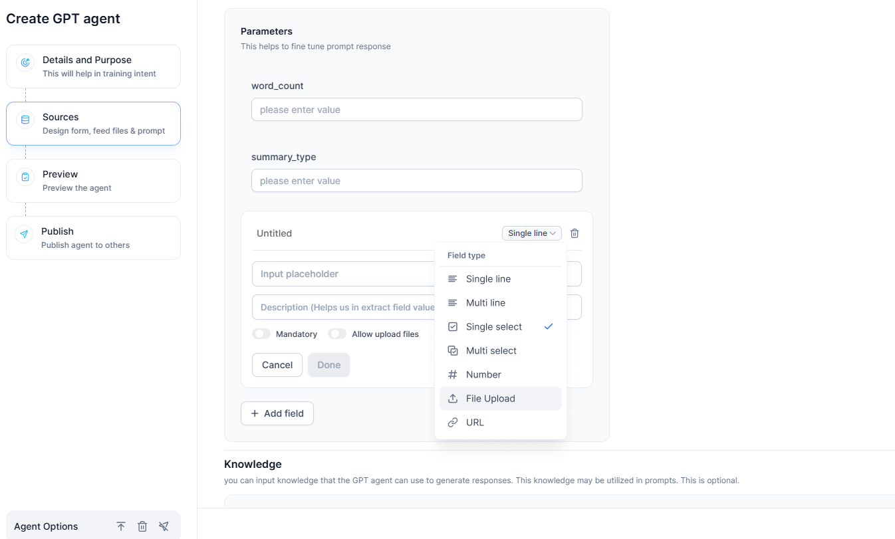

8.  Toggle the **Allow Upload Files** or **Allow URL Content** option to ON to
    enable file uploads or retrieval from URLs. This option is available only
    for Single-line and Multiline text field types.
    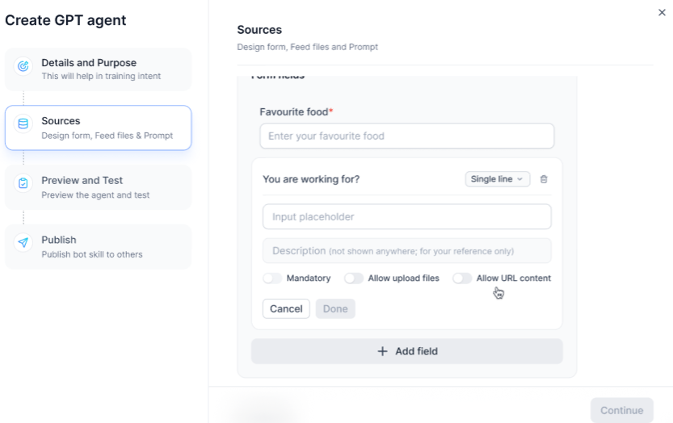

9.  Click the mandatory toggle button ON if you want the field to be mandatory
    and click **Done**.

#### Knowledge

1.  Click on the **+ Upload** button to upload any file. These uploaded files
    can be used as prompts. For example, if you uploaded a “Sample JD template”
    file, you can write a prompt that says, “Create a JD which is in the same
    format as in the Sample JD template
    file.”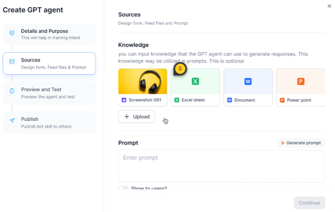

    **Note**: If the file size is larger, it affects the models due to the context
    size limitation, and an error message is displayed with the list of models.
    Only a certain limit of information is taken as context for generation.
    Still, when the limit of files is exceeded, all the knowledge files uploaded
    are used for answering but not for generation.

2.  Select the **Model** required from the Model selection drop-down list, which
    displays all the integrated
    models.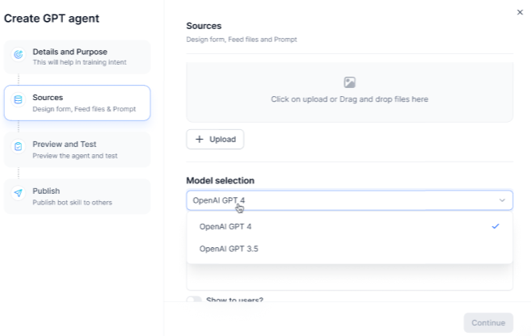

3.  Enable the **Show to users** toggle button to show this prompt to the user.
    Once you click the toggle button to ON, you can select whether you want it
    in **Read-only** or **Editable**.
    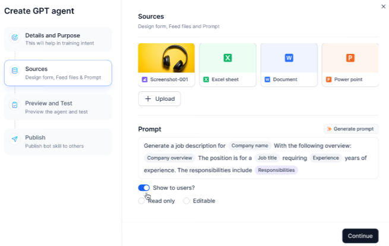

#### Prompt

A default prompt is automatically generated based on the purpose defined earlier
and can be customized using variables. For example, if the purpose is "Job
Finder," the default prompt might include, “Company Name, Job Title,
Responsibilities etc”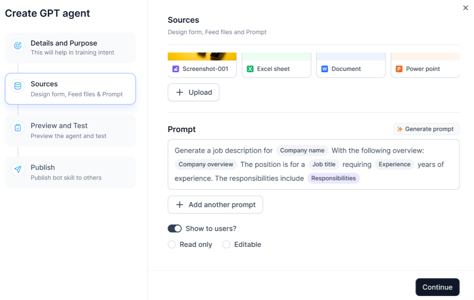

#### Multiprompt

For a multi-prompt setup within the agent builder, users can generate multiple
prompts and select one from the form field based on the specific context.

To add another prompt, click on the **+ Add another prompt** button. You can
also edit prompt names for clear, contextual labels and drag-and-drop reordering
for logical flow or priority. Click on the **Generate prompt** button to
generate a prompt based on your form’s purpose and field values.

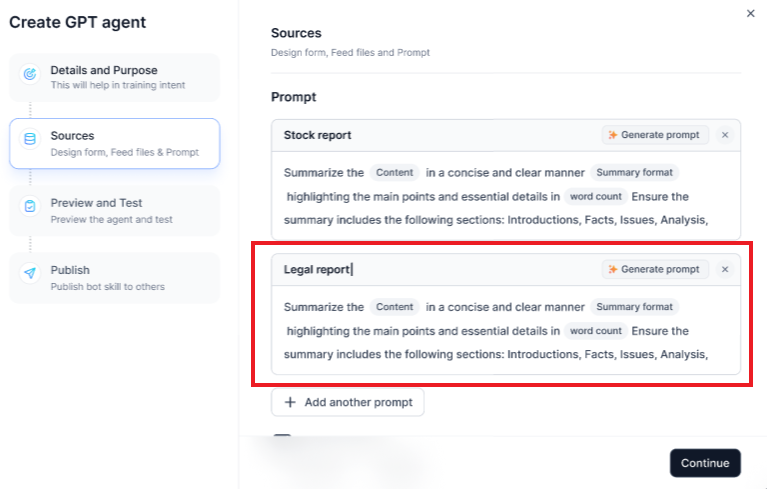

After adding multiple prompts you will find the response section form above
which will contain a prompt selector.

1.  Click on the edit option or anywhere in the prompt area. A dropdown menu
    will appear, displaying the available
    options.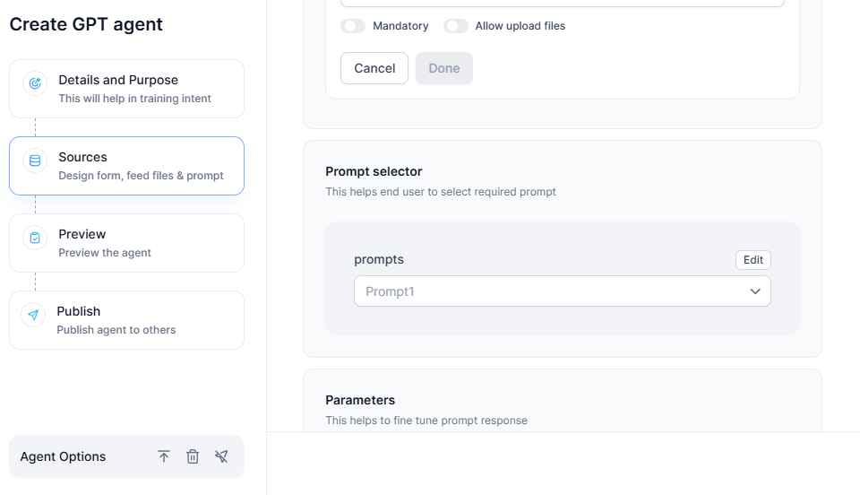

2.  For the prompt selector, you can edit field name and any placeholder text in
    the **placeholder text** field if
    required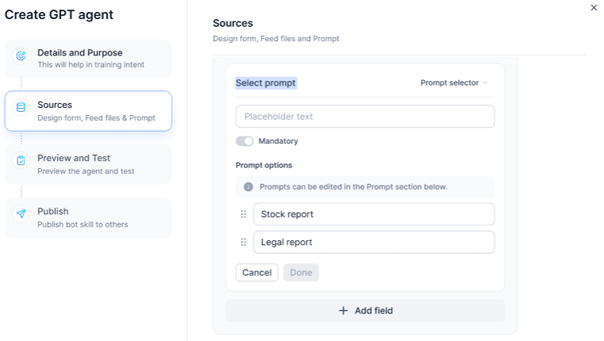

3.  Click the mandatory toggle button if you want the field to be mandatory.

4.  The prompt options display a list of all the prompts created, allowing you
    to drag and drop them to change their order.

5.  Click **Done**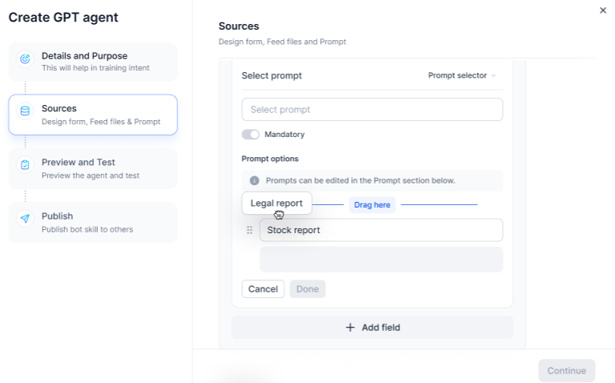

#### Multi Response

To allow users to generate multiple responses,

1.  enable the **Allow users to generate multiple responses** toggle button in
    the output settings.  
    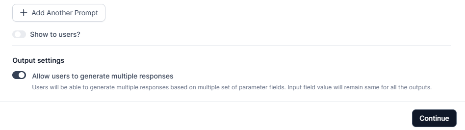

2.  Click **Continue** to move to the next step.

### Step 3: Preview

In the **Preview** section, a list of sample queries is displayed. If needed,
you can add additional queries by clicking the **+ Add Query** button. Once
you're ready, click **Continue** to proceed to the next
step.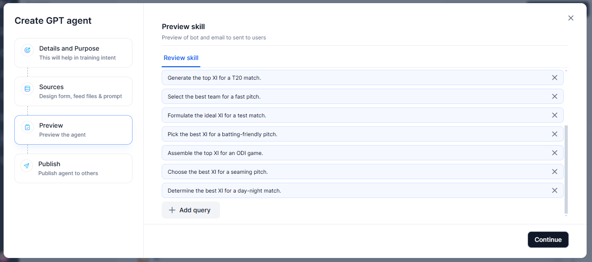

### Step 4: Publish GPT Agent

In the **Publish** section, you can finalize and deploy your GPT
agent.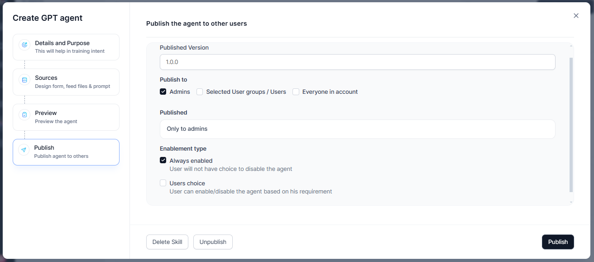 Follow the steps outlined
below to publish the GPT agent

1.  Provide the following details

    -   **Published Version**: Select the version of the agent you are
        publishing.

    -   **Publish to**: Choose who will have access to the agent:

        -   **Admins**: Restrict the agent to Admin users only.

        -   **Selected User Groups/Users**: Specify individual users or groups.

        -   **Everyone in the Account**: Make the agent available to all users.

    -   **Enablement Type**: Define how users can enable or disable the agent:

        -   **Always Enabled**: Users cannot disable the agent; it is always
            active.

        -   **User's Choice**: Users can choose whether to enable or disable the
            agent as needed.

2.  Click **Publish.** Once published, your agent is displayed in the Agent list
    of the Admin console page.

## Modify a GPT Agent

To modify the GPT agent, follow these steps:

1.  Navigate to the **Agents list** page and locate the agent you wish to
    modify.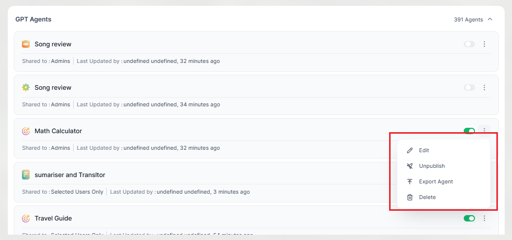

2.  Click the **three dots icon** next to the agent’s name. A menu with the
    following options will appear:

    -   **Edit** – Open and modify the agent's details.

    -   **Publish/Unpublish** – Change the agent's status.

    -   **Export Agent** : Download and export the configured agent.

    -   **Delete** – Permanently remove the agent.

1.  Click on the required option and continue to complete the modifications as
    needed.

## User Interaction

Users initiate their interaction by submitting simple queries, such as
requesting topic summaries. The agent processes these inputs and provides
concise, contextually relevant responses.

Users can also leverage the file upload and URL features, which support multiple
formats such as .pdf, .docx, .csv, and .xls. Once a file is uploaded, the system
processes its contents and generates the desired output, such as summaries,
reports, or insights, based on the data within the
file.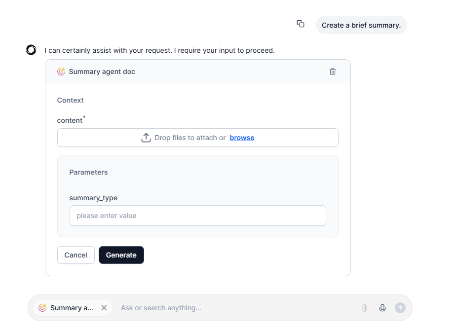

When multi-response is enabled, users can use this feature by selecting the
**Additional Response** option. Each prompt is preconfigured but can be
customized to meet specific requirements using a dropdown menu. Users have the
flexibility to define the input source for each response, either by using the
**initial input** or by selecting the output from a previous response as input
for subsequent responses. This configuration allows for a continuous flow of
information, making it ideal for scenarios requiring multiple perspectives or
formats.

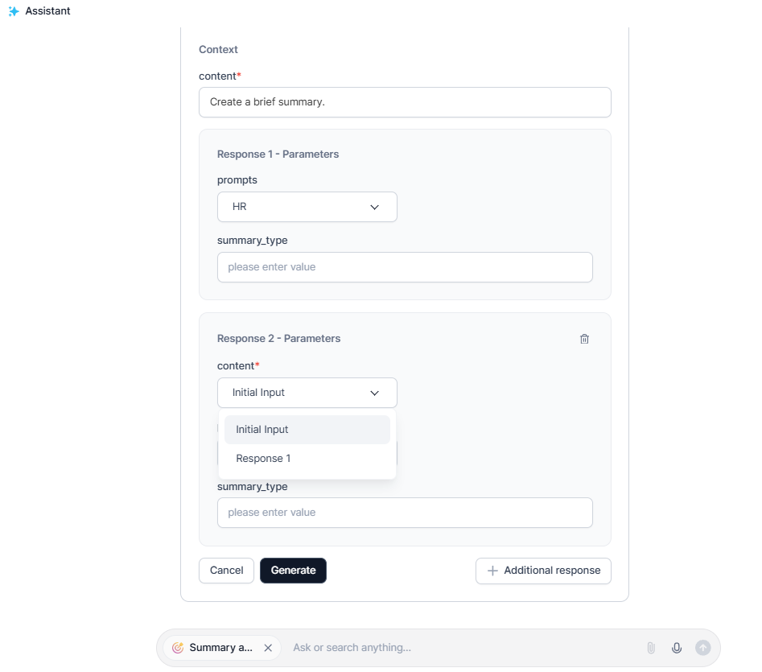  
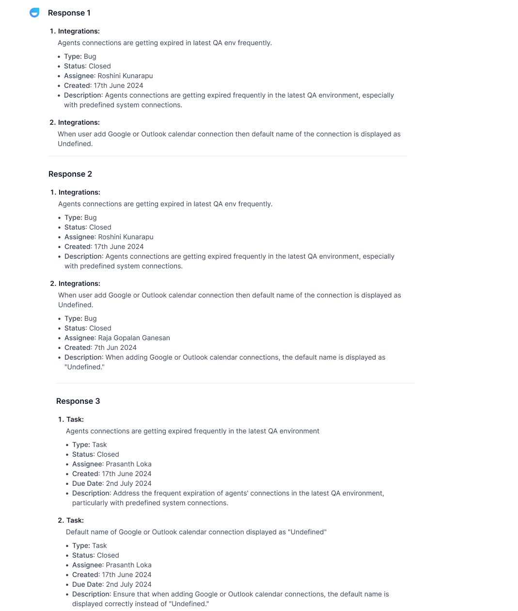
