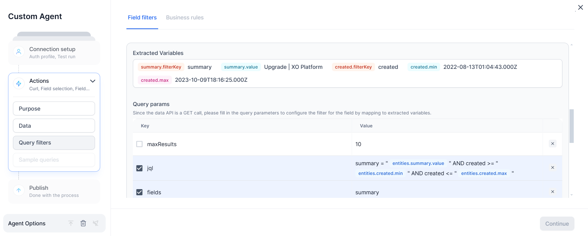
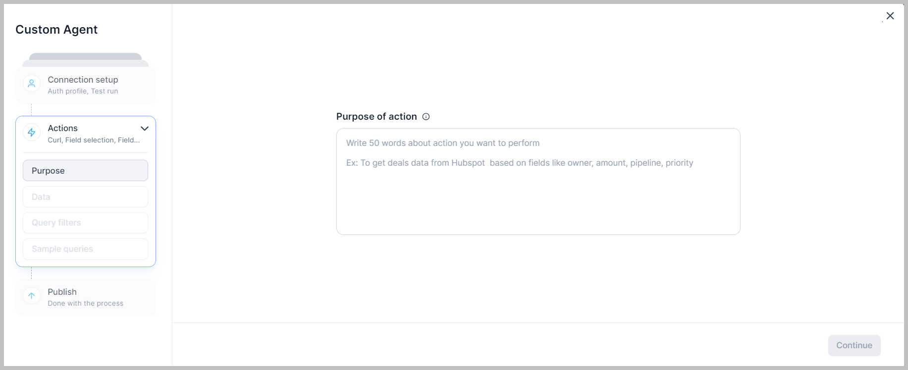
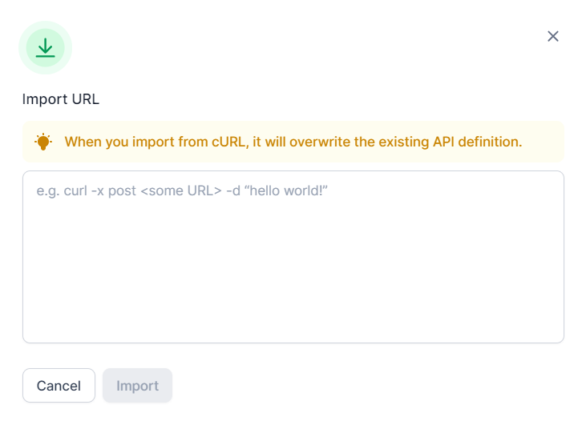
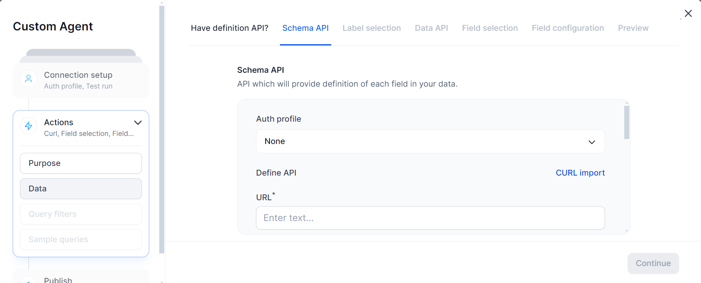
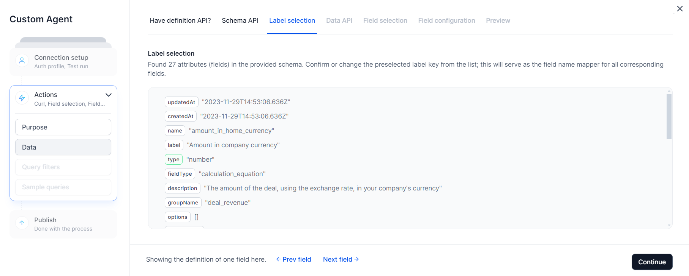
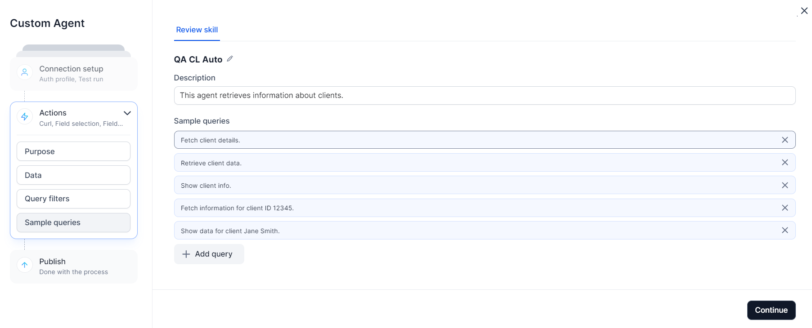
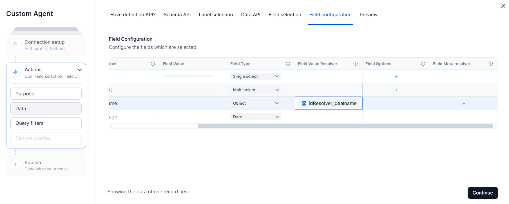
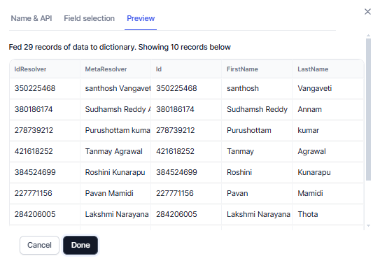

# API Agent / Data Agent

Data Agents Builder is a powerful feature that allows users to build data agents and integrate them with their legacy systems using APIs and a no-code builder. Data agents enable business users to interact seamlessly with their data through natural language queries.

## Key Features 

* **Easy Setup**: Users can create data agents through a step-by-step wizard in the admin console.
* **Flexible Configuration**: The tool supports various API types, authentication methods, and data processing options.
* **Customizable Fields**: Users can select and configure up to ten fields for querying and data representation.
* **Intelligent Querying**: The system handles simple lookups, compound queries, and computational requests.
* **Data Processing**: Features like ID and meta-resolution help present meaningful information to end users.
* **Preview and Testing**: Users can view processed data and test their configurations before publishing.
* **Sharing Options**: Agents can be shared with specific users, groups, or the entire organization.

**Note:** Currently, data agents can handle a maximum of 500 records per API response and support only standard REST APIs.

[https://www.loom.com/share/5324886f6acb459a9301bb19670ec9f2?sid=16db806f-85bf-4eae-b66a-c8962234154c](https://www.loom.com/share/5324886f6acb459a9301bb19670ec9f2?sid=16db806f-85bf-4eae-b66a-c8962234154c)

# Create a Data Agent

Users can create a data agent from the **User Profile** > **Admin Console **> **AI Search** > **API Agents **>** + Create Agent**. The setup wizard guides you through the entire process, from initial setup to deployment.

>>>>>  gd2md-html alert: inline image link here (to images/image1.png). Store image on your image server and adjust path/filename/extension if necessary.  (<a href="#">Back to top</a>)(<a href="#gdcalert2">Next alert</a>) >>>>> 

The Data Agent creation process consists of the following steps:

    Step 1: Define the purpose of the Agent.
    Step 2: Provide basic details of the Agent.
    Step 3: Set up a connection for data retrieval from an external system.
    Step 4: Define the specific Actions the data agent can perform.
    Step 5: Defines how to query or filter different data field types.
    Step 5: Publish the Agent.

Prerequisites:

* Administrator access to EVA and the system you want to integrate.
* API documentation for Schema API and Action API of the system.
* Curl commands for the ID resolver and the meta resolver of the system.

## Step 1: Purpose of Agent

Briefly describe the system you want to integrate and the desired actions you want to perform in 50 words. Example: "Integrate Jira system to manage tickets. Actions include getting ticket details, creating new tickets, or updating existing tickets." This purpose helps Data Agents understand your system's capabilities and accurately interpret user intents/requests using Generative AI.

Enter the purpose and click **Continue**.

>>>>>  gd2md-html alert: inline image link here (to images/image2.png). Store image on your image server and adjust path/filename/extension if necessary.  (<a href="#">Back to top</a>)(<a href="#gdcalert3">Next alert</a>) >>>>> 

## Step 2: Basic Details

In the Basic Details step, you can provide the Agent's name and select a logo. You can choose the logo from preset options or upload a custom image. The name and logo will represent the data agent in the user interface, helping users identify the source of information.

Enter a name for the **Agent** **Name**, select an appropriate **Logo**, and click **Continue**. \

>>>>>  gd2md-html alert: inline image link here (to images/image3.png). Store image on your image server and adjust path/filename/extension if necessary.  (<a href="#">Back to top</a>)(<a href="#gdcalert4">Next alert</a>) >>>>> 

## Step 3: Connection Setup

Connection Setup currently uses admin-provided profiles. The system accesses data using these profiles and admin tokens for all retrieval operations. End users cannot create new connection profiles, meaning all data is fetched using admin credentials.

## Step 4: Actions

### Step 4.1: Purpose

Briefly describe the specific action your data agent can perform, including what information the Agent can retrieve and from which fields. For example, "Get the Jira issues based on assignee, priority, status, and due date." The description helps the Agent understand and execute user requests accurately using Generative AI.

Currently, the Agent supports GET and POST actions, meaning the Agent can be configured to retrieve and write information.

Add the Purpose of action and click **Continue**.

>>>>>  gd2md-html alert: inline image link here (to images/image4.png). Store image on your image server and adjust path/filename/extension if necessary.  (<a href="#">Back to top</a>)(<a href="#gdcalert5">Next alert</a>) >>>>> 

### Step 4.2: Data

This section contains all the field configurations necessary for processing the data.

#### **Have Definition API**

You can choose one of the following options to define the data structure: 

* **API defining the fields**: Select this if you have an API that explicitly defines data fields.  This helps with field names in the actual API and prefills values for single-select and multi-select.
* **Continue with Data API**: Select this if you don't have a data-defining API. \
**Note**: This option disables the "Schema API" and "Label Selection" steps in the setup process. You can directly go to the Data API tab.

Select the option that best matches your API resources. The system will adapt to your chosen structure, ensuring an appropriate setup path.

 \

>>>>>  gd2md-html alert: inline image link here (to images/image5.png). Store image on your image server and adjust path/filename/extension if necessary.  (<a href="#">Back to top</a>)(<a href="#gdcalert6">Next alert</a>) >>>>> 

#### Schema API

The Schema API provides essential information about your data structure, such as field definitions, data types, possible values, custom fields, multi-select options, etc. This is crucial for understanding data structure, accurate data mapping, and proper integration with external systems (e.g., Jira, HubSpot).

To configure the schema API, provide the details - define it manually or use the CURL URL. Once the API details are entered, you can execute the API. If successful, click "Continue." If an error occurs, an appropriate message is displayed. 

This process ensures accurate data structure information for proper integration and handling.

**Note**: Authorization in the CURL URL overrides the previous user auth selection.

Follow these steps to add schema API:

1. On the **Schema API** tab, you can define the API manually or import it using CURL. For example, click **CURL Import**.

>>>>>  gd2md-html alert: inline image link here (to images/image6.png). Store image on your image server and adjust path/filename/extension if necessary.  (<a href="#">Back to top</a>)(<a href="#gdcalert7">Next alert</a>) >>>>> 

2. The import URL pop-up is displayed. \

>>>>>  gd2md-html alert: inline image link here (to images/image7.png). Store image on your image server and adjust path/filename/extension if necessary.  (<a href="#">Back to top</a>)(<a href="#gdcalert8">Next alert</a>) >>>>> 

3. Enter the URL and click **Import**.
4. On the **Schema API** tab, click **Run**.
5. The success pop-up is displayed. Click **Continue**. \

>>>>>  gd2md-html alert: inline image link here (to images/image8.png). Store image on your image server and adjust path/filename/extension if necessary.  (<a href="#">Back to top</a>)(<a href="#gdcalert9">Next alert</a>) >>>>> 

#### **Label Selection**

The system displays sample records from imported data in JSON format. You must select a key to serve as the field label name for end users, as the default key may be difficult to understand. The chosen key applies to all corresponding fields in the dataset.

You should map or replace existing keys with more appropriate definitions. This process replaces original field names with user-defined labels when loading the Data API into the system. This ensures that field names are meaningful and easily interpretable within the business context.

You can navigate through records using the "Prev field" and "Next field" options.

On the** Label Selection** tab, the attributes are displayed. Select the label and click **Continue**. \

>>>>>  gd2md-html alert: inline image link here (to images/image9.png). Store image on your image server and adjust path/filename/extension if necessary.  (<a href="#">Back to top</a>)(<a href="#gdcalert10">Next alert</a>) >>>>> 

#### **Data API**

You can define the data API manually or via the **CURL Import** option. This API provides the actual data. The system uses the authorization in the CURL URL, overriding previous user auth selections.

Follow these steps to add data API:

1. On the **Data API** tab, click **CURL Import**. \

>>>>>  gd2md-html alert: inline image link here (to images/image10.png). Store image on your image server and adjust path/filename/extension if necessary.  (<a href="#">Back to top</a>)(<a href="#gdcalert11">Next alert</a>) >>>>> 

2. The import URL pop-up is displayed. \

>>>>>  gd2md-html alert: inline image link here (to images/image11.png). Store image on your image server and adjust path/filename/extension if necessary.  (<a href="#">Back to top</a>)(<a href="#gdcalert12">Next alert</a>) >>>>> 

3. Enter the URL and click **Import**.
4. On the **Data API** tab, click **Run**.
5. The success pop-up is displayed. Click **Understood**. \

>>>>>  gd2md-html alert: inline image link here (to images/image12.png). Store image on your image server and adjust path/filename/extension if necessary.  (<a href="#">Back to top</a>)(<a href="#gdcalert13">Next alert</a>) >>>>> 

#### **Field Selection**

Field selection determines which data is visible to users and available for search queries, optimizing the user interface and the search functionality. You can select up to 10 fields from the API response for practical use within the system.

Example: In a Jira context, you can choose fields like assignee, status, priority, key, and summary for filtering and display. If you select only two out of five available fields, the system restricts search and display to those two fields only.

The screenshot below shows that the query can be generated using three selected fields - id, amount, and dealname.

On the **Select Fields **section, click the **field** to select. Click **Continue**.  \
You can navigate through records using the "Prev field" and "Next field" options.

>>>>>  gd2md-html alert: inline image link here (to images/image13.png). Store image on your image server and adjust path/filename/extension if necessary.  (<a href="#">Back to top</a>)(<a href="#gdcalert14">Next alert</a>) >>>>> 

#### **Field Configuration**

The Field Configuration tab lets you configure the fields that you selected earlier. The tab shows the following fields/attributes that can be configured: 

**Primary Field**:** **Select the primary field for the data table. This field will be the leftmost column presented to users.

**Field Key**: It shows user-chosen fields (non-editable) used to construct API requests. Each field corresponds to a specific API key, which may differ from the user-visible label. For example, "JIRA ID" might be displayed to users, but the API request uses "id" as the parameter.

This mapping ensures accurate data retrieval by translating user-friendly labels into the correct API parameters. The system creates precise API queries with selected fields and keys, balancing clarity and accuracy in data retrieval.

**Field Label**: Sourced from the schema API response and field selection tab. You can modify or add missing labels as needed. If the schema API doesn't provide a label, you can input one manually.

>>>>>  gd2md-html alert: inline image link here (to images/image14.png). Store image on your image server and adjust path/filename/extension if necessary.  (<a href="#">Back to top</a>)(<a href="#gdcalert15">Next alert</a>) >>>>> 

**Field Type**:** **The field type determines how users can query each field. This information is crucial for constructing appropriate filter APIs. For example, text fields require different query parameters compared to object fields.

Field types are primarily derived from the schema API. Additionally, the system employs internal logic to set field types when necessary. Some fields, like assignee, status, and priority, may be represented as nested JSON structures.

Accurate field types ensure the system generates correct query syntax for each field, enabling accurate and efficient data filtering. It also helps display appropriate options to users when they construct queries. 

>>>>>  gd2md-html alert: inline image link here (to images/image15.png). Store image on your image server and adjust path/filename/extension if necessary.  (<a href="#">Back to top</a>)(<a href="#gdcalert16">Next alert</a>) >>>>> 

**Field Value Resolver**: It's applicable only to object field types. A Field Value Resolver can help with the following:

* Handles and renders information returned from a data API.
* Maps values to appropriate labels and icons.
* Extracts and displays relevant data from nested JSON objects in a user-friendly format.

Field Value Resolvers maintain data integrity in presentation and interaction, bridging user-friendly labels with technical API requirements.

Follow these steps to add a field value resolver:

1. Click the **+** (Plus) icon in the field value resolver for the field type object. \

>>>>>  gd2md-html alert: inline image link here (to images/image16.png). Store image on your image server and adjust path/filename/extension if necessary.  (<a href="#">Back to top</a>)(<a href="#gdcalert17">Next alert</a>) >>>>> 

2. The Value Resolver pop-up is displayed.
    1. If the field value resolver didn't find the JSON, the following value resolver pop-up is displayed. Click **Define API** to resolve the id. \

>>>>>  gd2md-html alert: inline image link here (to images/image17.png). Store image on your image server and adjust path/filename/extension if necessary.  (<a href="#">Back to top</a>)(<a href="#gdcalert18">Next alert</a>) >>>>> 

        1. Click **CURL Import**. You can also use a dictionary instead of a CURL import. Learn [how to create one](#bookmark=id.nr9zbkjujebh). \

>>>>>  gd2md-html alert: inline image link here (to images/image18.png). Store image on your image server and adjust path/filename/extension if necessary.  (<a href="#">Back to top</a>)(<a href="#gdcalert19">Next alert</a>) >>>>> 

        2. The import URL pop-up is displayed. Paste the URL and click **Import**. \

>>>>>  gd2md-html alert: inline image link here (to images/image19.png). Store image on your image server and adjust path/filename/extension if necessary.  (<a href="#">Back to top</a>)(<a href="#gdcalert20">Next alert</a>) >>>>> 

        3. Type in the **Sample Input** and click **Run**.
        4. The Output Fields are displayed. \

>>>>>  gd2md-html alert: inline image link here (to images/image20.png). Store image on your image server and adjust path/filename/extension if necessary.  (<a href="#">Back to top</a>)(<a href="#gdcalert21">Next alert</a>) >>>>> 

        5. Close the pop-up. The ID resolver is displayed. \

>>>>>  gd2md-html alert: inline image link here (to images/image21.png). Store image on your image server and adjust path/filename/extension if necessary.  (<a href="#">Back to top</a>)(<a href="#gdcalert22">Next alert</a>) >>>>> 

    2. If the field value resolver finds the JSON, the following value resolver pop-up is displayed. \

>>>>>  gd2md-html alert: inline image link here (to images/image22.png). Store image on your image server and adjust path/filename/extension if necessary.  (<a href="#">Back to top</a>)(<a href="#gdcalert23">Next alert</a>) >>>>> 

        6. Click **Goto Mapper**. \

>>>>>  gd2md-html alert: inline image link here (to images/image23.png). Store image on your image server and adjust path/filename/extension if necessary.  (<a href="#">Back to top</a>)(<a href="#gdcalert24">Next alert</a>) >>>>> 

        7. Click **Map Value**. Select fields pop-up is displayed. This step resolves the fields. \

>>>>>  gd2md-html alert: inline image link here (to images/image24.png). Store image on your image server and adjust path/filename/extension if necessary.  (<a href="#">Back to top</a>)(<a href="#gdcalert25">Next alert</a>) >>>>> 

        8. Select the field which is displayed to the user and close the pop-up. For example, "displayName".
        9. Click **Map ID**. Select fields pop-up is displayed. \

>>>>>  gd2md-html alert: inline image link here (to images/image25.png). Store image on your image server and adjust path/filename/extension if necessary.  (<a href="#">Back to top</a>)(<a href="#gdcalert26">Next alert</a>) >>>>> 

        10. Select the field that will be passed to the API and close the pop-up. For example, "accountId".
        11. If Map Color, Map Icon, and Map Icon Color information is available, map the required fields and close the pop-up. \

>>>>>  gd2md-html alert: inline image link here (to images/image26.png). Store image on your image server and adjust path/filename/extension if necessary.  (<a href="#">Back to top</a>)(<a href="#gdcalert27">Next alert</a>) >>>>> 

3. The field value resolver mapping is completed.

**Field Options**: Field Options are predefined choices for single-select or multi-select fields, helping users filter and retrieve data accurately. These options are activated when a field is identified as single-select or multi-select and are typically fetched from the schema API.

Each option includes a label, value, display order, and visibility status. This structure allows for flexible and customizable presentation of choices to the user.

**A crucial feature of Field Options is the mapping between user-friendly labels and technical keys required for API requests**. For example, while a user might see a "Priority" field with options like "High," "Medium," and "Low," the API might use corresponding numerical or string values. This mapping ensures accurate data retrieval by configuring what is displayed to the user and what is sent in API requests.

**Note**: This field is applicable only if the Field Type is Single Select or Multi Select.

Follow these steps to add field options:

1. Click the **+** (Plus) icon in the field option for the field type Single Select or Multi Select.
2. The options pop-up is displayed. \

>>>>>  gd2md-html alert: inline image link here (to images/image27.png). Store image on your image server and adjust path/filename/extension if necessary.  (<a href="#">Back to top</a>)(<a href="#gdcalert28">Next alert</a>) >>>>> 

3. Enter the **Map Value **(Displayed to the user) and **Map Label **(sent to the API) for each priority.
    1. If the schema API is mapped:
        1. Click **Map Value**, the JSON object is displayed.
        2. Select the field that will be passed to the API.
        3. Click **Map Lable**, the JSON object is displayed.
        4. Select the field which will be displayed to the user.
        5. Rest all the choices are automatically populated.
    2. If the schema API is not mapped, manually enter map value and map label for each choice. \
For example, if you have high, medium, and low priority choices. \

>>>>>  gd2md-html alert: inline image link here (to images/image28.png). Store image on your image server and adjust path/filename/extension if necessary.  (<a href="#">Back to top</a>)(<a href="#gdcalert29">Next alert</a>) >>>>> 

4. Close the pop-up.

**Field Meta Resolver**: The Field Meta Resolver interprets user-provided meta-information and determines the correct value to send to the API. It resolves specific field values at runtime before making API calls, ensuring data retrieval and filtering accuracy.

This resolver includes an API module for defining and testing with sample input. It works similarly to an ID resolver, requiring the definition of the API call and the input mapping for both value and ID.

A key function of the Field Meta Resolver is retrieving the id of entities extracted from the user query.

**Note**: This field is applicable only if the Field Type is Object.

Follow these steps to add a field meta resolver:

1. Click the **+** (Plus) icon in the field meta resolver for the field type object.
2. Click **CURL Import**. You can also use a dictionary instead of a CURL import. Learn [how to create one](#bookmark=id.nr9zbkjujebh). \

>>>>>  gd2md-html alert: inline image link here (to images/image29.png). Store image on your image server and adjust path/filename/extension if necessary.  (<a href="#">Back to top</a>)(<a href="#gdcalert30">Next alert</a>) >>>>> 

3. The import URL pop-up is displayed. Paste the URL and click **Import**. \

>>>>>  gd2md-html alert: inline image link here (to images/image30.png). Store image on your image server and adjust path/filename/extension if necessary.  (<a href="#">Back to top</a>)(<a href="#gdcalert31">Next alert</a>) >>>>> 

4. Type in the **Sample Input** and click **Run**. \

>>>>>  gd2md-html alert: inline image link here (to images/image31.png). Store image on your image server and adjust path/filename/extension if necessary.  (<a href="#">Back to top</a>)(<a href="#gdcalert32">Next alert</a>) >>>>> 

5. The Output Fields are displayed. \

>>>>>  gd2md-html alert: inline image link here (to images/image32.png). Store image on your image server and adjust path/filename/extension if necessary.  (<a href="#">Back to top</a>)(<a href="#gdcalert33">Next alert</a>) >>>>> 

6. Close the pop-up. The ID resolver is displayed. \

>>>>>  gd2md-html alert: inline image link here (to images/image33.png). Store image on your image server and adjust path/filename/extension if necessary.  (<a href="#">Back to top</a>)(<a href="#gdcalert34">Next alert</a>) >>>>> 

7. Click **Continue**.

**Dictionary**

If API support is unavailable, you can use a dictionary as a local data store to map and resolve IDs or metadata. It acts as a cache, storing data fetched from APIs for fast, local queries, reducing the need for repeated API calls. You can schedule automatic updates to keep the dictionary current. Once created, it can be shared across agents or modules within the same account, making it a useful tool for improving performance and reducing dependency on APIs.

Follow these steps to create a dictionary:

1. On the field value resolver or field meta resolver popup, toggle the **Use Dictionary**.
2. Click **+ Create**.
3. On the Name & API tab, enter the **dictionary name**, **API call details** to feed the dictionary, and **pagination** details if required. \

>>>>>  gd2md-html alert: inline image link here (to images/image34.png). Store image on your image server and adjust path/filename/extension if necessary.  (<a href="#">Back to top</a>)(<a href="#gdcalert35">Next alert</a>) >>>>> 

4. Click **Run API**. The field selection tab is displayed.
5. On the Field Selection tab, **select the fields** to be searched, **ID resolver field**, **Schedule to Pool data** frequency, and enter the **meta resolver field**. \

>>>>>  gd2md-html alert: inline image link here (to images/image35.png). Store image on your image server and adjust path/filename/extension if necessary.  (<a href="#">Back to top</a>)(<a href="#gdcalert36">Next alert</a>) >>>>> 

6. Click **Pool data into the dictionary**. The preview tab is displayed.
7. On the Preview tab, the pooled data is displayed. \

>>>>>  gd2md-html alert: inline image link here (to images/image36.png). Store image on your image server and adjust path/filename/extension if necessary.  (<a href="#">Back to top</a>)(<a href="#gdcalert37">Next alert</a>) >>>>> 

8. Click **Done**. The dictionary is saved. \

#### **Preview**

Displays processed data to users, initially showing five records with an option to load more. Users can configure an “open” option that appears when hovering over any record. Clicking it will open a record in a new tab. 

>>>>>  gd2md-html alert: inline image link here (to images/image37.png). Store image on your image server and adjust path/filename/extension if necessary.  (<a href="#">Back to top</a>)(<a href="#gdcalert38">Next alert</a>) >>>>> 

Follow these steps to create a URL:

1. To configure the URL, click  **+ Create URL**.
2. The Open URL pop-up is displayed. \

>>>>>  gd2md-html alert: inline image link here (to images/image38.png). Store image on your image server and adjust path/filename/extension if necessary.  (<a href="#">Back to top</a>)(<a href="#gdcalert39">Next alert</a>) >>>>> 

3. Enter the Static URL. For example, https://koreteam.atlassian.net/browse/. \
**Note**: You can create a Dynamic URL using the response objects. 
4. The Variable mapper pop-up is displayed. Select the dynamic part of the URL i,e **Key,** and close the pop-up. \

>>>>>  gd2md-html alert: inline image link here (to images/image39.png). Store image on your image server and adjust path/filename/extension if necessary.  (<a href="#">Back to top</a>)(<a href="#gdcalert40">Next alert</a>) >>>>> 

5. Click **Done**. The Open option and the configured link are displayed. \

>>>>>  gd2md-html alert: inline image link here (to images/image40.png). Store image on your image server and adjust path/filename/extension if necessary.  (<a href="#">Back to top</a>)(<a href="#gdcalert41">Next alert</a>) >>>>> 

6.  Click **Continue**.

### Step 4.3: Query Filters

There are two types of query filters:

#### Field Filters

Field Filters lets you define which fields are available for querying and filtering data. Fields can be marked as queryable and mandatory. When a field is mandatory, users must specify its value to retrieve data. For instance, if "Project" is set as mandatory in Jira issue queries, EVA prompts you to specify the project before returning any results.

Additionally, field filters generate a sample query based on the selected fields and the uploaded API document. Running this query automatically produces a configuration builder script. This script manages various field combinations and compound queries, saving you from manual scripting. Field Filters provide filter configurations for different fields, combinations, and data types. Ensure you test the generated configurations and refine the script if necessary.

Follow these steps to configure the filters:

1. The selected fields are auto-populated.
    * In the **Allow Query** column, select the fields on which you want to run a query. By default, all the fields are selected.
    * Select the **Mandatory** checkbox for fields that you want to make mandatory for a running query. This field is disabled if the respective Allow Query field is not selected.
    * Edit the **Field_Filter_Key** if required. This key is sent to the API. In a few cases, the field filter key differs when pushing data versus retrieving it. The populated keys are generated based on the API response.

         \

>>>>>  gd2md-html alert: inline image link here (to images/image41.png). Store image on your image server and adjust path/filename/extension if necessary.  (<a href="#">Back to top</a>)(<a href="#gdcalert42">Next alert</a>) >>>>> 

 \

2. Click **Configure**. The “Click the sample query to configure API documentation” message and sample query are displayed. \

>>>>>  gd2md-html alert: inline image link here (to images/image42.png). Store image on your image server and adjust path/filename/extension if necessary.  (<a href="#">Back to top</a>)(<a href="#gdcalert43">Next alert</a>) >>>>> 

3. Click **Upload API documentation**. The smart configuration pop-upload is displayed. Paste the API documentation and click **Save**. The query parameters are auto-populated. \

>>>>>  gd2md-html alert: inline image link here (to images/image43.png). Store image on your image server and adjust path/filename/extension if necessary.  (<a href="#">Back to top</a>)(<a href="#gdcalert44">Next alert</a>) >>>>> 

4. Click **Sample Query**. The extracted variables are displayed. \

>>>>>  gd2md-html alert: inline image link here (to images/image44.png). Store image on your image server and adjust path/filename/extension if necessary.  (<a href="#">Back to top</a>)(<a href="#gdcalert45">Next alert</a>) >>>>> 

5. Depending on the API type, perform the following.
    * For a GET call, the "query parameters" section is displayed. Uploading the API documentation pre-fills this section, and you can configure it directly. You add additional query parameters as needed. \

>>>>>  gd2md-html alert: inline image link here (to images/image45.png). Store image on your image server and adjust path/filename/extension if necessary.  (<a href="#">Back to top</a>)(<a href="#gdcalert46">Next alert</a>) >>>>> 

    * For a POST call, the "body" section is displayed. Uploading the API documentation pre-fills this section as well, and you configure it using the variable mapper. \

>>>>>  gd2md-html alert: inline image link here (to images/image46.png). Store image on your image server and adjust path/filename/extension if necessary.  (<a href="#">Back to top</a>)(<a href="#gdcalert47">Next alert</a>) >>>>> 

        **Note**: Ensure that the configuration includes only variables in place of entities. This allows the APIs to be dynamically generated during runtime.

6. Scroll down and click **Run**. The configuration builder script is generated. This script runs on the sample query and displays the API response. \

>>>>>  gd2md-html alert: inline image link here (to images/image47.png). Store image on your image server and adjust path/filename/extension if necessary.  (<a href="#">Back to top</a>)(<a href="#gdcalert48">Next alert</a>) >>>>> 

7. Click **Run Queries** to execute/test all the generated queries. If all the queries are executed correctly, the success message is displayed. If not, the error message is displayed.

>>>>>  gd2md-html alert: inline image link here (to images/image48.png). Store image on your image server and adjust path/filename/extension if necessary.  (<a href="#">Back to top</a>)(<a href="#gdcalert49">Next alert</a>) >>>>> 

8. (Optional) To fix failed queries, click **Script** to view and edit them. You can proceed without fixing, but only successful queries will work after publishing. To learn more about the query, click it.
9. Click **Continue**.

#### Business Rules

Business rules can enhance the Agent's ability to provide relevant and controlled responses. There are two types of business rules:

**Entity Rule**: Entity Rules allow administrators to add extra entities or information to user queries, even if the user does not explicitly mention them. These rules help tailor the Agent's response to business needs or expectations that may not be apparent from the user's input alone. Entity Rules are triggered for the active Agent.

Example: Interpreting "active deals" as deals in specific stages like "presentation," "working progress," or "contract in progress". When a user asks about active deals, the rule automatically adds these statuses to the query.

Click **Entity Rule** and enter the **Rule**. Click **Activate** and click **Continue**. 

>>>>>  gd2md-html alert: inline image link here (to images/image49.png). Store image on your image server and adjust path/filename/extension if necessary.  (<a href="#">Back to top</a>)(<a href="#gdcalert50">Next alert</a>) >>>>> 

**Answering Rule**: Answering rules allow administrators to control and customize responses. 

These rules act as prompts, guiding the Agent's behavior when specific conditions are met. They activate when the Agent is triggered with appropriate intent and keywords. Answering rules offers flexibility in managing responses, allowing administrators to fine-tune the Agent's behavior for consistency and control over information provided to users.

Example: An answering rule could be set up to respond with "contact sales" for any pricing-related questions.

Click **Answering Rule** and enter the **Rule**. Click **Activate** and click **Continue**. 

>>>>>  gd2md-html alert: inline image link here (to images/image50.png). Store image on your image server and adjust path/filename/extension if necessary.  (<a href="#">Back to top</a>)(<a href="#gdcalert51">Next alert</a>) >>>>> 

### Step 4.4: Sample Queries

Sample queries are automatically generated based on the system's purpose and actions. These queries serve as quick references and starting points for users interacting with the data agent.

When a data agent is triggered, the sample queries are displayed. The user can click them to execute the associated actions. 

You can manually add sample queries based on specific system requirements. This can be done using the **+ Add Query** option. Click **Continue**.

>>>>>  gd2md-html alert: inline image link here (to images/image51.png). Store image on your image server and adjust path/filename/extension if necessary.  (<a href="#">Back to top</a>)(<a href="#gdcalert52">Next alert</a>) >>>>> 

## Step 5: Publish

When publishing the Data Agent, name the version and choose recipients - admins, selected user groups/users, or everyone in the account. Select authentication - user-based or admin-based. Review and edit steps before publishing. If you choose admin-based, admin tokens extract the data. If you choose user-based, user tokens extract the data. After publishing, the log shows the version name, publication date, and publisher. This process allows customized sharing and authentication while maintaining a published version record.

Select **Publish to** and **Authentication type**. Click **Publish**.

The success message and the data agent are displayed on the Agents page.

>>>>>  gd2md-html alert: inline image link here (to images/image52.png). Store image on your image server and adjust path/filename/extension if necessary.  (<a href="#">Back to top</a>)(<a href="#gdcalert53">Next alert</a>) >>>>> 

