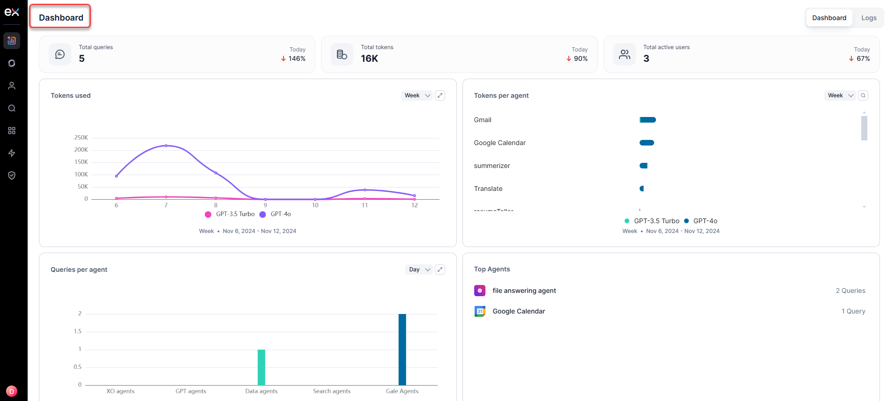

# Dashboard

The dashboard provides a history of all administrative tasks. It displays the key performance metrics, trends, and reports, enabling you to gauge its real-time usage and performance. 

The following illustration shows an example of the Analytics Dashboard of the Admin Console.

You can switch between the Dashboard view and the Data view.

## Dashboard View

The different types of reports generated under the Dashboard view are:

* Tokens used
* Tokens per agent
* Queries per agent
* Top Agents
* Top Users
* Users
* Average response time
* Errors
* Feedback

At the top of the Dashboard view, you can also see the total queries, total tokens, and total active users for the day.

### Token Used

This dashboard presents a graphical representation of token usage trends across various models. Users can view and analyze data across different periods, with options to display trends by **Day**, **Week**, or **Month**.  

Metrics displayed for each model include:
* Model Name
* Total Tokens Used
* Context Tokens
* Generation Tokens
* Timestamp (Date & Time)

At any point, the display will show a 30-minute average for the daily view, a 6-hour average for the weekly view, and a daily average for the monthly view.

The left-right navigation displays the detailed metrics at each point, with access to previous and subsequent days, weeks, or months.

### Tokens Per Agent

This displays a graphical representation of the number of tokens per agen. You can switch between different periods for the view, including **Day**, **Week**, and **Month**.

Metrics displayed for each model include:

* Agent Name
* Model Name
* Total token count
* Generation token count
* Context token count

The left-right navigation displays the detailed metrics at each point, with access to previous and subsequent days, weeks, or months.

### Queries Per Agent

This displays a graphical representation of the number of queries per agent, categorized by agent type, including XO, GPT, Data, Search, and Gale agents.

You can switch between different periods for the view, including **Day**, **Week**, and **Month**.  

Metrics displayed for each model include:

* Agent Name
* No of Queries
* Timestamp (Date & Time)

The left-right navigation displays the detailed metrics at each point, with access to previous and subsequent days, weeks, or months.

### Top Agents

This displays the queries corresponding to the top agents in descending order.

### Top Users

This displays the queries corresponding to the top 10 users.  

### Users

This displays a bar graph with the number of unique users interacting with the system, comparing web vs. native platforms.

You can switch between different periods for the view, including **Day**, **Week**, and **Month**.

Metrics displayed include:

* Total User
* Channel
* Timestamp (Date & Time)

The left-right navigation displays the detailed metrics at each point, with access to previous and subsequent days, weeks, or months.

### Average response time

This displays a graphical representation of the average response time of the service.

You can switch between different periods for the view, including **Day**, **Week**, and **Month**.

Metrics displayed include:

* Average response time
* Timestamp (Date & Time)

At any point, the display will show a 30-minute average for the daily view, a 6-hour average for the weekly view, and a daily average for the monthly view.

The left-right navigation displays the detailed metrics at each point, with access to previous and subsequent days, weeks, or months.

### Errors

This displays a graphical representation of the number of queries with errors.  

Metrics displayed include:

* Total Errors
* Timestamp (Date & Time)

The left-right navigation displays the detailed metrics at each point, with access to previous and subsequent days, weeks, or months.

### Feedback

This displays a graphical representation of the feedback provided by the end user in the application. 

Metrics displayed include:

* Feedback
* Queries
* Timestamp (Date & Time)

The left-right navigation displays the detailed metrics at each point, with access to previous and subsequent days, weeks, or months.

## Data View

The different parameters under the Data view are:

* Request ID
* Users
* Questions
* Overall Tokens
* Response time
* Agent type
* Status
* Timestamp

In the data, each record corresponds to a user utterance. Click **More** to open a specific data entry, where you will find a detailed view of the utterance, including the triggered questions and received answers.

### Data Parameters

The data parameters for a specific data is as follows:

**Request Information**

* Request ID
* User Name and Email Id
* User ID
* Channel: Mobile/Web	
* Previous Context: Yes/ No
* Thread ID
* Feedback Comments
* Timestamp: Date and time

**Query Details**

* Question
* Query Points

**LLM Usage**

* Model
* Total Tokens
* Request Tokens
* Response Tokens

**Execution Analyzer**

Expand the **Execution analyzer** to examine the steps performed in the background. If a user needs to debug a query, they can access the **Execution Analyzer** to view the exact prompt sent for each step, allowing them to see precisely what was sent to the model. This includes options for debugging each step if required, enabling users to review the response from the LLM and identify any issues.

At the top of the data view of a specific data, you can also see the Response status, Response time, and Feedback type of that data.
