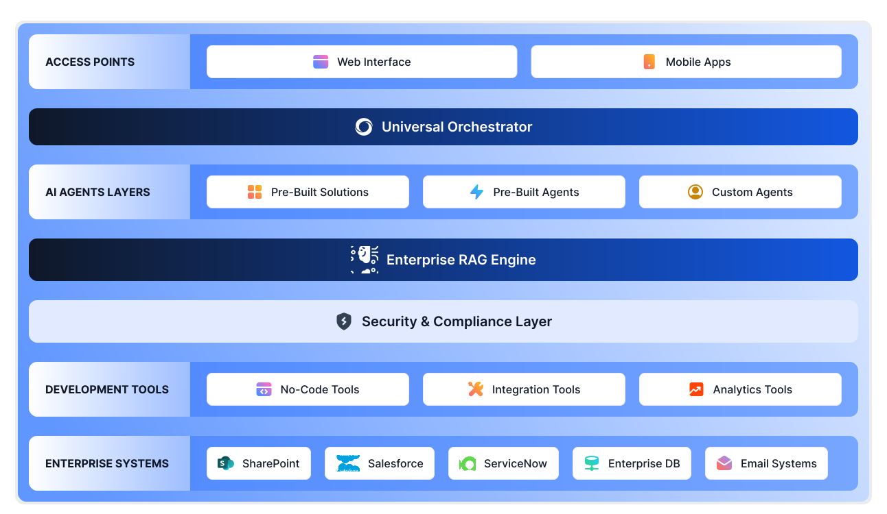

---
hide:
  - toc
  - feedback
---

# Introducing All-new AI for Work Platform

AI for Work is a unified enterprise AI platform that significantly enhances enterprise productivity by enabling employees to focus on high-value work while AI handles the rest. The platform aims to fundamentally transform how organizations operate and how employees get work done. It addresses some of the most pressing challenges facing the modern workplace, including:

* Employees spend significant time searching for information across fragmented systems.

* Managing routine and repetitive tasks that consume valuable employee time.

* Difficulty leveraging AI and automation for employees without technical backgrounds.

The platform provides intelligent solutions to each of these pain points. It democratizes powerful AI capabilities and makes them accessible to all employees through a unified, intuitive interface. It empowers every employee to work more efficiently and intelligently, regardless of their role or technical expertise. 

### Key Capabilities

* **Unified Information Access**: It provides unified access to knowledge across structured and unstructured sources, synthesizes information from multiple systems in real-time, generates context-aware responses that understand business terminology, and automatically maintains security and compliance boundaries. 

* **Multi-step Workflow Automation**: It can execute actions across multiple enterprise applications, handle complex multi-step business workflows, manage enterprise system interactions and data flow, and automate routine business transactions and processes.

* **Intelligent Orchestration**: An intelligent coordination layer called the Universal Orchestrator maintains contextual awareness across scenarios, routes requests to appropriate AI agents, executes multi-step flows while preserving context, and handles seamless handoffs between different AI capabilities.

* **Advanced Knowledge Work Support**: It enables accelerated content creation and analysis, real-time summarization and insights, contextual assistance across all work activities, and progressive automation of routine knowledge tasks.

# Unified Platform for Enterprise Productivity

Architecturally, AI for Work is designed to provide a unified and flexible framework for implementing AI capabilities within an enterprise context. It combines pre-built components, customization options, and integration capabilities to address a wide range of business needs while ensuring security and compliance.

**Key components and layers that make up the platform**:

=== "Access Points"

    Users can access AI for Work through a web-based interface or mobile applications.   
    
=== "Universal Orchestrator"

    This is the central intelligence layer that coordinates and manages interactions between different components of the platform.    
    
=== "AI Agents"

    * Pre-Built Solutions: Ready-to-use AI solutions that can be quickly deployed for common common department needs, such as IT support automation, HR service management, and Recruitment process automation.
    
    * Pre-Built Agents: AI for Work includes a set of pre-configured AI agents that can be easily customized and integrated into workflows.
    
    * Custom Agents: Enterprises can develop their own custom AI agents tailored to their specific requirements.       

=== "Enterprise RAG Engine"

    This component powers intelligent information retrieval and processing capabilities within the platform.
        
=== "Security & Compliance"

    This layer ensures the platform adheres to enterprise security standards and compliance regulations.  
    
=== "Development Tools"
    
    * No-Code Tools: AI for Work provides no-code tools that allow users to build and customize AI solutions without requiring programming skills.
    
    * Integration Tools: These tools enable integration with various enterprise systems and data sources.
    
    * Analytics Tools: Built-in analytics capabilities help organizations measure and optimize the performance of AI agents and workflows.   

=== "Enterprise Systems"

    Common enterprise systems that AI for Work can integrate with, such as SharePoint, Salesforce, ServiceNow, Enterprise databases, and Email systems.

## Implementation and Deployment Approach

The platform follows a pragmatic deployment strategy, starting with basic capabilities in a few weeks and progressively expanding to custom solutions within a few months. This measured approach ensures quick wins while building toward comprehensive enterprise AI capabilities.

Enterprises can start with high-impact, readily deployable capabilities in areas like IT service automation and enterprise search. They can then progress to additional pre-built AI agents for HR and Recruitment and create custom AI solutions for unique departmental needs.

