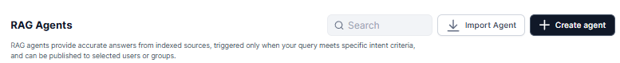
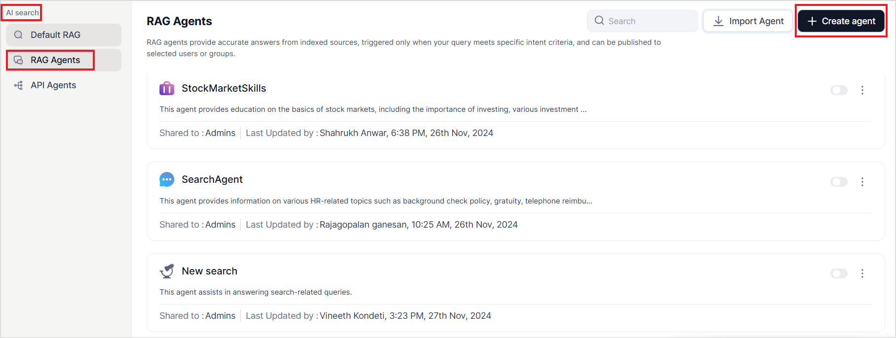
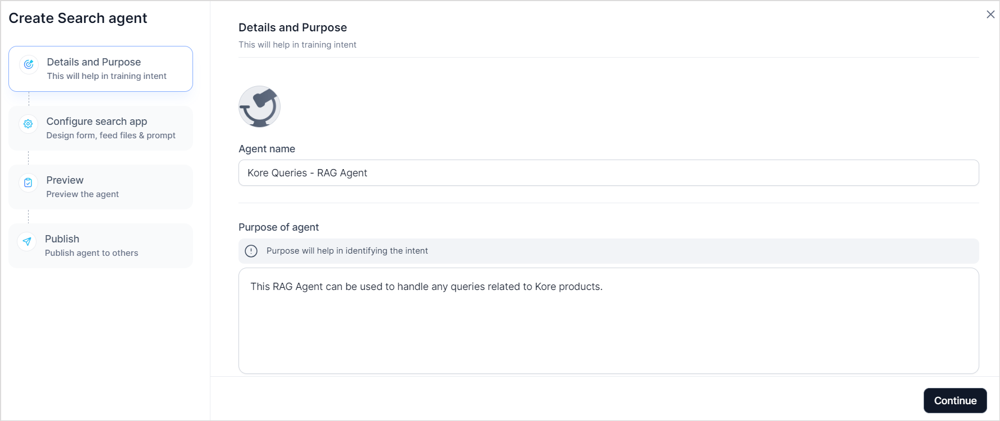
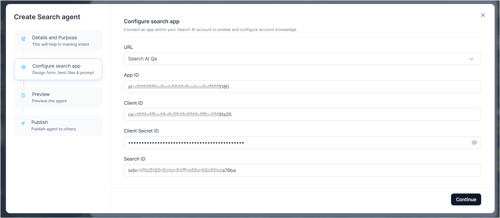
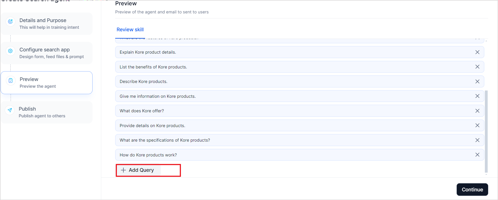
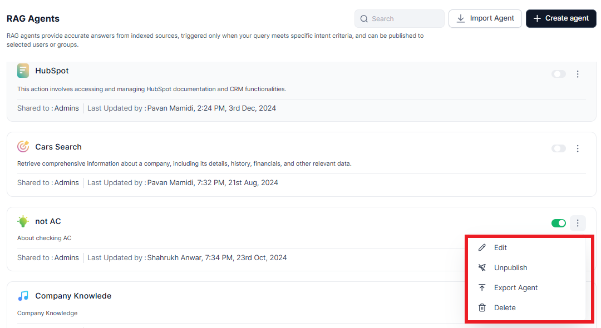
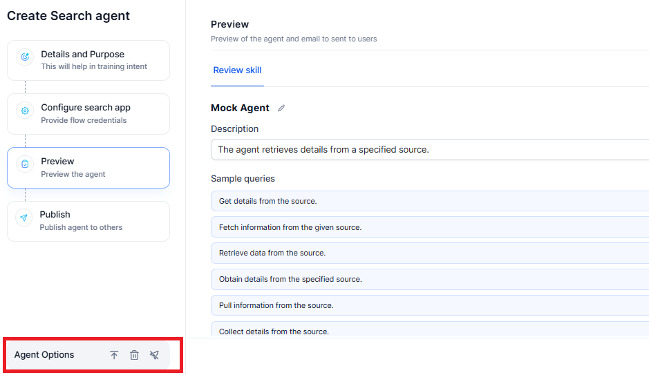
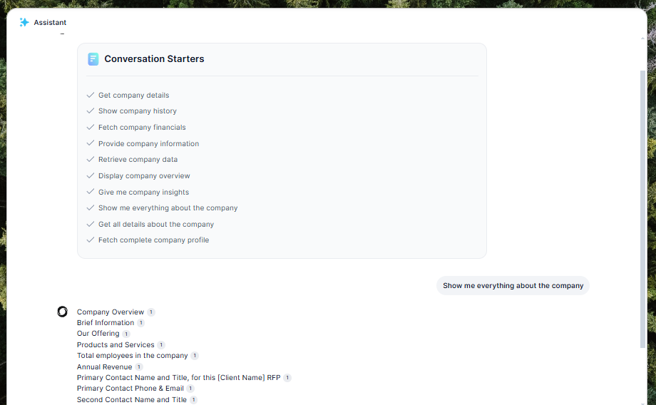

# RAG Agents

RAG stands for **Retrieval Augmented Generation**. RAG Agents combine retrieval
and generation techniques to provide accurate and contextually relevant answers
to user queries. RAG agents leverage existing knowledge bases to find and
retrieve relevant information and then use LLM models to generate an accurate
and precise response.

**RAG agents in AI for Work** can be implemented through **Search AI** applications.
Search AI allows you to configure and index content from various knowledge
bases, files, and websites in the application, which is then used to dynamically
provide answers to user queries. RAG Agents interact with the Search AI
application to answer the user queries. [Learn
more](https://docs.kore.ai/xo/searchai/about-search-ai/).

For instance, you can build a RAG Agent that handles queries related to Kore's
products by creating a **Search AI application**. Configure the application to
index all relevant information about Kore products from various sources, such as
the company website, documentation sites, product guides, and FAQ pages. Once
the content is indexed, create a **RAG Agent** that can interact with this
Search AI application to retrieve and generate accurate, up-to-date information.
This agent will respond to user queries with relevant product details, ensuring
comprehensive and efficient support for all Kore product-related inquiries.  

**RAG Agents offer the following advantages**:

-   **Accurate Responses**: RAG agents ensure the answers are accurate and
    up-to-date by dynamically retrieving relevant content from the knowledge
    bases and generating accurate and contextually appropriate responses.

-   **Natural Language Interaction:** The RAG Agents' LLM capabilities enable
    the use of natural language without the need for complex search keywords,
    making the conversation more human-like and easy for users to understand.

-   **Access to Comprehensive Knowledge**: RAG agents can combine knowledge
    retrieval from multiple sources, offering access to comprehensive knowledge
    and ensuring answers to all queries are in one place.

## Difference between RAG Agents and Default RAG

The main distinction between **RAG Agents** and **Default RAG** lies in their
configuration and scope:

-   **Default RAG** uses the Search AI application, provisioned with the AI for
    Work account by default. It serves as a fallback mechanism when no specific
    agent matches the user's query intent.

-   **RAG Agents** are specifically configured for different intents or
    purposes. Each RAG agent can be designed to handle particular types of
    queries based on the user’s intent. Therefore, the Search AI application it
    is configured with should have relevant knowledge aligned with the intent.  
    
    When a query aligns with the purpose of a specific configured RAG agent,
    that agent takes over to generate a response. If no matching RAG agent is
    found for the given intent, the system defaults to the **Default RAG** for
    the response.

You can create a new agent or import an existing one.

-   [Import existing workflow or GALE agent](#import-existing-rag-agent)

-   [Create RAG agent](#create-rag-agents)

# Import existing RAG agent

To import an existing RAG agent:

1.  Click the **Import** **Agent** button located in the upper-right
    corner.

2.  Select the .ZIP file of the existing
    agent.

3.  Click **Import** to complete the process. The imported agent will appear on
    the RAG Agents page.

# Create RAG Agents

### Prerequisites

Before creating a RAG Agent, ensure that the **Search AI** application is
configured accurately to enable the retrieval and generation of responses.
Follow these steps to prepare:

* [Create a search AI](https://docs.kore.ai/searchassist/getting-started/build-and-publish-your-first-searchassist-app/) application.

* [Configure content sources](https://docs.kore.ai/searchassist/manage-content-sources/content-overview/) in the application.

* Fine-tune the application [search settings](https://docs.kore.ai/xo/searchai/chunk-browser/) to generate appropriate responses.

* [Enable Answers](https://docs.kore.ai/searchassist/concepts/personalizing-results/about-answers/).

* Train the application.

* Enable the [Client Channel for communication](https://docs.kore.ai/searchassist/administration/web-sdk-integration/#Step_1_Configure_Channel_and_credentials).
    Ensure that the appropriate API scope is enabled for the application.

-   The Search AI application is ready for communication.

To create a RAG Agent, go to the **AI Search** page on the **Admin Console.** Go
to **RAG Agents** and click on **Create Agent.**

The **RAG Agent creation** wizard will take you through the following steps:

1.  Define the purpose of the agent and provide the details.

2.  Provide the configuration details of the Search AI application to set up the
    interaction between the RAG Agent and the Search AI application.

3.  Review the Agent configuration.

4.  Publish the Agent.

### Step 1: Details and Purpose

Provide a suitable and unique **name** for the agent. Briefly describe the
**purpose** of the agent. Defining the agent’s purpose enables the system to accurately
recognize the agent’s capabilities and effectively utilize them to respond to
user queries aligned with the specified intent. It is essential to clearly
outline the specific use cases for which the agent is designed. This ensures
that it is used to generate responses to the intended queries.

For instance, if an agent is designed to answer all the user queries related to
Kore Products, specifying it as the purpose helps the system use this agent whenever a
user sends a query related to any Kore products.

### Step 2: Configure Search App

The next step is to configure the Search AI app, which has the indexed content
used for answer generation. Provide the following details for integration.   

  

These details are available in the **Search AI app** on the **Credentials** page
under the **Manage** tab. Refer to
[this](https://docs.kore.ai/xo/searchai/about-search-ai/) for more details.

-   **URL**: Select your Search AI instance where the application is hosted.

-   **App ID**: Application ID of the Search AI app.

-   **Client ID**: Client credentials generated in Search AI for interaction
    with the RAG Agent.

-   **Client Secret ID**: A secret key generated for secure interaction.

-   **Search ID**: Unique identifier of the client generated in Search AI.

### Step 3: Preview

Review the skills generated for the agent based on the purpose defined. The system uses
Generative AI to create sample queries to which the agent can respond. You can
**add, modify, or remove** sample queries to refine the agent's interaction
capabilities.

### Step 4: Publish RAG Agent

Provide the following details for publishing the agent and click **Continue**.

-   **Published Version**: Select the version of the agent you are publishing.

-   **Publish to**: Choose who will have access to the agent:

    -   **Admins**: Restrict the agent to Admin users only.

    -   **Selected User Groups/Users**: Specify individual users or groups.

    -   **Everyone in the Account**: Make the agent available to all users.

-   **Enablement Type**: Define how end users can enable or disable the agent from the agent store:

    -   **Always Enabled**: Users cannot disable the agent; it is always active.

    -   **User's Choice**: Users can choose whether to enable or disable the
        agent as needed.

# Modify a RAG Agent

To modify the RAG agent, follow these steps:

1.  Navigate to the **Agents list** page and locate the agent you wish to
    modify.  
    
    

2.  Click the **three dots icon** next to the agent’s name. A menu with the
    following options will appear:

    -   **Edit** – Open and modify the agent's details.

    -   **Publish/Unpublish** – Change the agent's status.

    -   **Export Agent** - The agent's data is packaged into a ZIP file for
    download, migration, or import into another system.

    -   **Delete** – Permanently remove the agent.

3.  Click on the required option and continue to complete the modifications as
    needed.

# Agent Option

The agent options allow you to export, delete, and un-publish the agent.

# User Interaction

Interacting with the RAG Agent ensures users get the information they need
quickly and efficiently. Users can select the specific agent and start by typing
a query, such as "Get company details," "Fetch company financials," or "Show
company history." The agent processes the query using indexed content from
available resources like knowledge bases, files, or websites, and provides
relevant, accurate answers. For broader insights, users can request more
detailed data, like "Show me everything about the company" or "Fetch complete
company profile."

