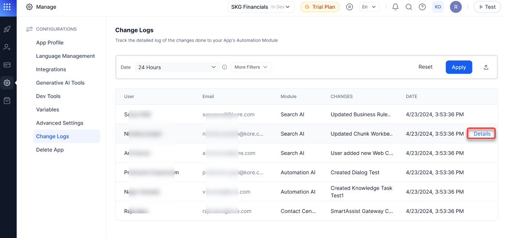
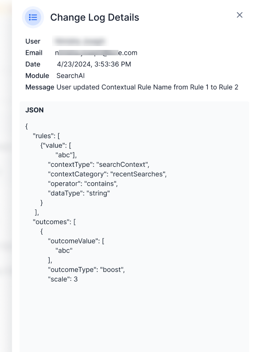
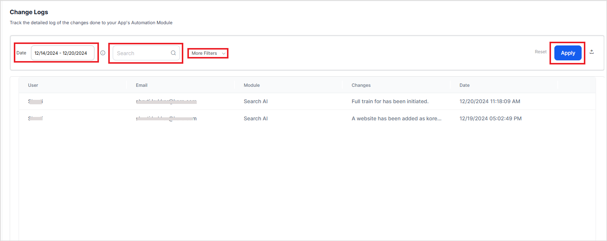

# Change Logs

Change Logs keep record of all the modifications made to the application. They are essential for tracking changes and are particularly useful for debugging, identifying configuration updates, and understanding their impact on application performance.

## Accessing Change Logs
To access the changelogs, follow the below steps:

1. Navigate to **App Settings**.
2. By default, the **App Profile** page is displayed.
3. On the left pane, click **Change Logs**.
4. The Change Logs page displays log files from all modules of the application, by default. Each log entry includes the following details:
    * User Name and Email ID: Identifies who made the change.
    * Module: Specifies the module where the change occurred.
    * Changes: Provides a brief description of the change.
    * Date: Timestamp indicating when the change was made.

For more information about a specific change, click on the **Details** link.

This page shows the change made to the application in JSON format.

## Search and Filter Options

The Change Logs page includes search and filter functionalities to locate specific log entries. Filters can be applied to view logs from a specific module, for a given timeframe, from a specific user or with specific changes.

