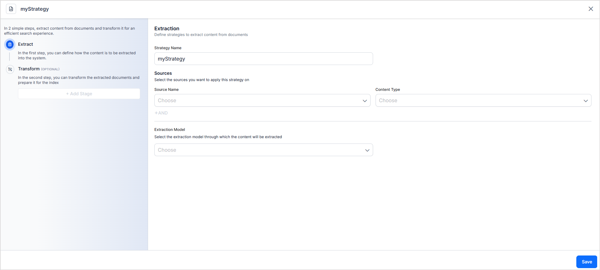
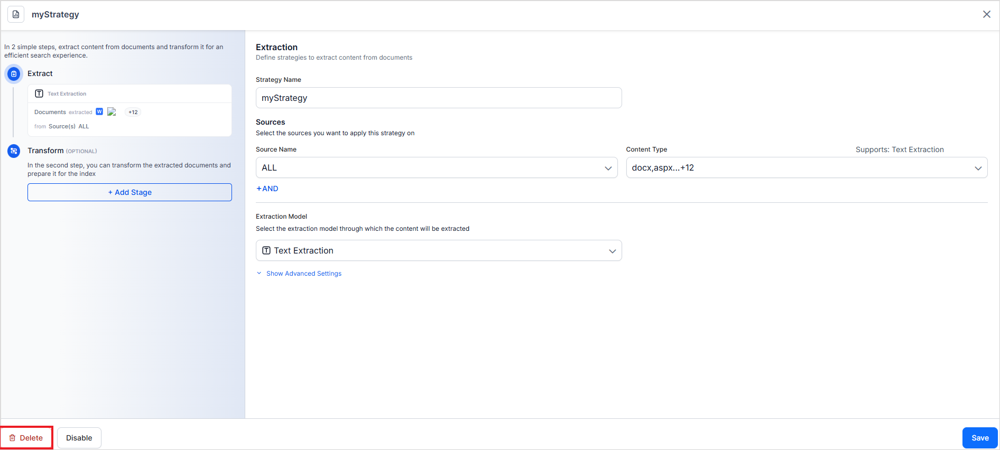
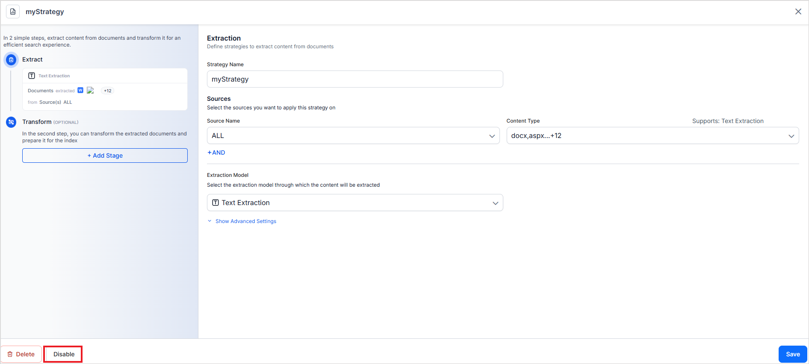

# Content Extraction

To generate answers using the source data, the ingested data is segmented into smaller segments or chunks to organize and efficiently retrieve the most relevant data set when required. Selecting an appropriate extraction strategy requires considering several factors, like the type of content, the embedding model to store chunks, the expected length and complexity of user queries and answers, etc.

The application supports various chunk-generation strategies. You can select and customize the strategies based on the format and structure of the ingested data or as per the answers required. You can configure multiple strategies to apply to different types of content. Aligning the strategy to the document characteristics improves the precision of answers and gives you flexibility and granular control over the answers generated.  

To view the strategies defined in an application or to make any changes, go to the **Extract** page under the **Index** tab. 

By default, every application has a **Default Strategy** configured to perform Text-based Extraction on all types of data ingested from different sources. 

## Adding a new Strategy

To add a new extraction strategy, click on the **+Add Strategy** button.

Enter the strategy details on the following page. 

**Strategy Name**: Enter a unique name for the strategy for identification. 

**Define Source**: Use the fields here to define the source data on which this strategy is applicable. 

* **Source Name**: This field allows you to select the data on which the strategy is to be applied. It lists all the data sources configured in the application and the content corresponding to each of them. 
* **Content Type**: This field allows you to specify the content type within each data source. 

You can also use the logical **AND operator** to apply multiple rules to filter the data on which a particular extraction strategy is to be applied. For instance, to select all the SearchAI marketing material (assuming, available as PDF files in a given directory), you can define the source as shown below.

**Define Chunk Strategy**: This field specifies the chunk strategy and its configuration for the selected source.

**Extraction Model**: Select the extraction model from the drop-down menu. The extraction model defines the technique applied to break down large pieces of textual information into manageable chunks. We currently support the following extraction models.

### **Text Extraction Model**

The Text Extraction Model combines natural language processing (NLP) and machine learning techniques. It is based on the concept of tokenization, where the text is segmented into smaller units. The model undergoes training to identify and extract the most suitable chunks relevant to the search queries.

**Configuration**: Use the **chunk size** field  to define the size of a single chunk. This field can help optimize the relevance of the content retrieved for answer generation. Choose the value of this field depending on various factors, like the structure and type of content, type of expected user queries, type of embedding models used, etc. 

* When **Chunk Size** is set to **pages**, every page is treated as a single chunk. 
* When **Chunk Size** is set to **Chunk Tokens**, chunks are prepared using the following two parameters:
    *  **Tokens**: Maximum number of tokens that can be present in a chunk. This field can take a maximum value of 1000. The optimal number depends on the nature of the content. Smaller chunks might be used for detailed, granular tasks, whereas larger chunks might be necessary for understanding context​​.
    * **Chunk Overlap**: Number of tokens that should overlap between two consecutive chunks.

### **Layout Aware Extraction (BETA)**

Layout-aware chunk extraction is a strategy used to extract data by considering the content's layout and structure. This method allows for the customization of data extraction based on the specific layout or format of the content, which can improve the precision of the extracted information. Configuring the strategy according to specific layout requirements makes it possible to extract chunks of data more effectively, aligning the strategy to the document characteristics. This provides flexibility and granular control over the extraction process, ultimately leading to more accurate and relevant data retrieval for answer generation or other purposes. 

The layout-aware extraction method identifies objects in documents by combining OCR technology, layout detection models, and layout awareness rules. This approach improves SearchAssist's ability to comprehend tables, graphs, and charts in documents and generate answers using this information.

**Configuration**: Choose the appropriate **template** for content extraction. Use examples to customize the content format according to the template for optimum extraction results. 

* **General:** Use the **General** template to extract content from **complex PDFs and docx** files, including tables and images. 

Configure the strategy as per your needs and click the **Save** button. 

### **Advanced HTML Extraction**

This strategy is specially designed to extract data from tables and images in HTML files along with textual content. 

**Configuration**: 

**Chunk Method Template**: Choose the appropriate template for content extraction.

* **General**: This template identifies different components and classes within an HTML document and generates chunks based on them. Tables and images present between the content are also extracted and stored as chunks, which are then used to present answers to users.
* **Token-Based:** This template generates chunks based on the token size configuration. Any images present between the content are also extracted and stored in the chunk.
* **Tokens**:  The number of tokens to be present in each chunk. This value can vary between 100 and 1000 and the default value is 300. 
* **Chunk Overlap**: The number of tokens that can overlap between adjacent chunks. This field can take values between 10 and 100. 

!!! note
    A strategy is automatically enabled as soon as it is created. However, creating a strategy does not automatically initiate the extraction process. Use the **Train** option to initiate the extraction process.   

## Deleting a Strategy

To delete an existing strategy, go to the corresponding strategy page and click on the **Delete** button. 

!!! note
    Deleting a strategy does not affect the existing chunks.

## Enabling/ Disabling a Strategy

By default, as soon as a strategy is created, it is enabled. You can also temporarily disable a strategy for testing purposes to evaluate alternative extraction strategies or when it is no longer needed. You can do so from the strategy page. 

## Using Multiple Extraction Strategies

When more than one strategy is defined in a given application, the strategies are applied to the data based on their priority or sequence in the list. For example, if two strategies are defined - one for the web pages and the other one (default strategy) that applies to all types of content, the sequence decides the strategy to be used for a given content type. If the default strategy is at the top, it will extract chunks from all the sources, and the other strategy will not be used. If, on the other hand, the strategy for web pages is on top, it will be applied first and extract the chunks from the web pages, followed by the extraction of chunks from all other sources using the default extraction strategy.  

To **change the sequence** of the strategies, drag and drop the strategy up or down as required.

